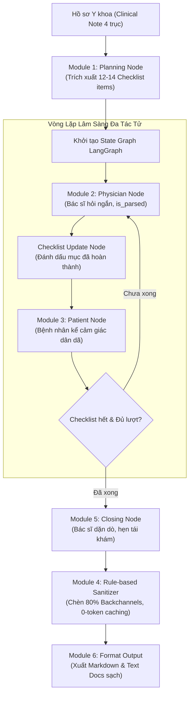

# TỔNG HỢP TOÀN BỘ PROMPTS PIPELINE & ĐỐI SÁNH CHI TIẾT VỚI ACL 2024

> **Tài liệu tham chiếu:** Hệ thống sinh hội thoại y khoa lâm sàng tiếng Việt (**VietMed-Data-600 / NoteChat Engine**)
> **Mục đích:** Tích hợp trực tiếp đối sánh 3 cột *(Prompt Hiện Tại — Prompt Gốc ACL 2024 — Phân Tích Sự Khác Biệt & Cải Tiến)* vào từng module nghiệp vụ trong pipeline, giúp tra cứu, kiểm thử và tối ưu hóa hệ thống.

---

## 📑 MỤC LỤC HỆ THỐNG MODULES

1. [Tổng quan Kiến trúc & Luồng Xử lý](#1-tổng-quan-kiến-trúc--luồng-xử-lý)
2. [Module 1: Planning Module (Lập Kế Hoạch & Trích Xuất Checklist Lâm Sàng)](#module-1-planning-module-lập-kế-hoạch-lâm-sàng)
3. [Module 2: Physician Agent (Nhập Vai Bác Sĩ & Điều Tiết Khám Thực Thể)](#module-2-physician-agent-nhập-vai-bác-sĩ)
4. [Module 3: Patient Agent (Nhập Vai Bệnh Nhân & Mô Tả Cảm Giác Cơ Thể)](#module-3-patient-agent-nhập-vai-bệnh-nhân)
5. [Module 4: Dialogue Sanitizer & Token-Free Caching (Tối Ưu Token & Câu Đệm 80%)](#module-4-dialogue-sanitizer--token-free-caching)
6. [Module 5: Closing Module (Dặn Dò Hồi Phục & Hẹn Tái Khám)](#module-5-closing-module-kết-thúc-phiên-khám)
7. [Module 6: Graph State Machine & Output Formatting (Tổ Chức Luồng & Xuất Dữ Liệu)](#module-6-graph-state-machine--output-formatting)
8. [Module 7: Context-Injection RAG & Syllable Budgeting (Sinh Nhanh Theo Âm Tiết)](#module-7-context-injection-rag--syllable-budgeting)
9. [Module 8: Length Guard & Dynamic Auto-Extension (Bù Đắp Thời Lượng Tự Động)](#module-8-length-guard--dynamic-auto-extension)
10. [Phụ lục: Bộ Mẫu Văn Phong Thực Tế (Few-Shot Style Library)](#phụ-lục-bộ-mẫu-văn-phong-thực-tế-few-shot-style)

---

## 1. TỔNG QUAN KIẾN TRÚC & LUỒNG XỬ LÝ



---

## MODULE 1: PLANNING MODULE (LẬP KẾ HOẠCH LÂM SÀNG)

### 1.1. Bảng Đối Sánh 3 Cột

| Prompt Hiện Tại (VietMed-600 Pipeline) | Prompt Gốc ACL 2024 (Table 11 NoteChat) | Sự Khác Biệt & Cải Tiến Đột Phá |
|:---|:---|:---|
| **Nội dung Prompt:**<br>```text
Bạn là Cố vấn Y khoa cao cấp của hệ thống NoteChat.
Dưới đây là Hồ sơ Bệnh án của bệnh lý: "{disease_name}"
=== HỒ SƠ Y KHOA (CLINICAL NOTE) ===
{clinical_note}
===================================
NHIỆM VỤ: Lập CHECKLIST gồm 12-14 từ khóa/chủ đề cốt lõi
cho buổi khám thời lượng {duration_min} phút theo đúng
TRÌNH TỰ KHÁM LÂM SÀNG THỰC TẾ:
1. Lý do khám & Triệu chứng ban đầu
2. Vị trí, tính chất cảm giác đau & thời gian kéo dài
3. Hướng lan & yếu tố tăng/giảm đau
4. Mức độ ảnh hưởng sinh hoạt & giấc ngủ
5. Tiền sử bản thân, thói quen nghề nghiệp & thể thao
6. Khám thực thể: Tư thế và sờ nắn tìm điểm đau chói
7. Khám thực thể: Nghiệm pháp đặc hiệu 1
8. Khám thực thể: Nghiệm pháp đặc hiệu 2 & biên độ
9. Giải thích Cận lâm sàng (X-quang / MRI / Siêu âm)
10. Chẩn đoán xác định & giải thích cơ chế bệnh sinh
11. Kê đơn thuốc chi tiết (NSAIDs, giãn cơ, bọc dạ dày)
12. Giải đáp thắc mắc tác dụng phụ dạ dày / lo phẫu thuật
13. Hướng dẫn phục hồi chức năng & kiêng cữ tại nhà
14. Dặn dò lịch tái khám & lời chúc sức khỏe
YÊU CẦU ĐẦU RA:
- Trả về đúng 1 mảng JSON chứa 12-14 chuỗi ngắn gọn.
``` | **Nội dung Prompt:**<br>```text
Apply the physician and Patient prompt to generate the beginning and lead the physician LLM to ask about the medical record. Continue to generate 20 to 40 utterances conversations between physician and patient to ask or tell the patient regarding the case (you must follow up the history conversation).
The conversations you generate must cover all the keywords I gave you. You cannot revise or eliminate any keywords and you cannot use synonyms of the keywords.
Your conversation should also include all information. If it's difficult to include all the information and key words, you can use the original sentences in the clinical note.
Your generation must follow the logical sequence of a physician's inquiry. For example, the general logical order of the conversation is: first discussing symptoms, then discussing the medical history, followed by discussing testing and results, and finally discussing the conclusion and treatment options, etc. The physician didn't know any information of medical history or symptoms. This information should be told by the patient.
``` | **1. Tách module lập kế hoạch riêng biệt:** ACL 2024 gộp chung prompt lập kế hoạch với prompt sinh toàn bộ 20-40 lượt thoại (dễ gây nghẽn context và bỏ sót bước). Hiện tại tách thành 1 Agent Planning độc lập chạy trước vòng lặp.<br><br>**2. Cấu trúc hóa JSON Checklist 12-14 bước:** Thay vì đưa từ khóa rời rạc (`key1, key2`), hệ thống trích xuất thành mảng JSON 12–14 mục cụ thể bám sát 4 trục lâm sàng (Triệu chứng - Khám thực thể - Cận lâm sàng - Kê đơn 4 nhóm thuốc).<br><br>**3. Dynamic Tracking qua StateGraph:** Danh sách kiểm tra này được StateGraph cập nhật động qua từng lượt (`checklist_update_node`), đảm bảo không bỏ sót bất kỳ triệu chứng hay xét nghiệm nào. |

---

## MODULE 2: PHYSICIAN AGENT (NHẬP VAI BÁC SĨ)

### 2.1. Bảng Đối Sánh 3 Cột

| Prompt Hiện Tại (VietMed-600 Pipeline) | Prompt Gốc ACL 2024 (Table 12 Physician) | Sự Khác Biệt & Cải Tiến Đột Phá |
|:---|:---|:---|
| **Nội dung Prompt:**<br>```text
Bạn là Bác sĩ giàu kinh nghiệm ({doc_name}), phong cách: {doc_style}.
Bạn đang trong ca khám trực tiếp với bệnh nhân {pat_name}.
=== HỒ SƠ Y KHOA (CLINICAL NOTE) ===
{clinical_note}
===================================
MỤC TIÊU LÂM SÀNG LƯỢT NÀY (CURRENT FOCUS):
-> "{current_focus}"
LỊCH SỬ ĐỐI THOẠI GẦN NHẤT:
{history_text}
QUY TẮC BẮT BUỘC:
1. Nhịp điệu ngắn gọn: Tối đa 3 câu, dưới 30 từ. Chỉ hỏi ĐÚNG 1 ý trọng tâm xoay quanh current_focus.
2. Thường xuyên tóm tắt/nhắc lại ngắn gọn câu trả lời vừa rồi để xác nhận.
3. TUYỆT ĐỐI KHÔNG XƯỚNG TÊN NGHIỆM PHÁP (Neer, Hawkins, Lasegue, Schober...) hay nói "dương tính/âm tính" với bệnh nhân. Khi khám chỉ hướng dẫn động tác bằng lời thường ("Bác giơ tay lên từ từ...").
4. Đọc kết quả phim MRI/X-quang chủ động, KHÔNG hỏi ngược lại bệnh nhân.
5. Kê đơn thuốc đầy đủ hoạt chất, liều lượng, dặn uống sau ăn no tránh hại dạ dày.
6. CHỈ LỜI NÓI CẤT TIẾNG CHO TTS (0 dấu ngoặc, 0 mô tả cử chỉ).
ĐỊNH DẠNG ĐẦU RA JSON:
{
  "text": "Lời phát ngôn trực tiếp của Bác sĩ",
  "is_parsed": true hoặc false,
  "reason": "Giải thích vì sao có thể/không thể chèn Vâng Dạ"
}
``` | **Nội dung Prompt:**<br>```text
Please role-play as a physician and further generate questions or conclusion, or the test result (such as medication test result or vital signs) based on the above dialogue and clinical note (after mentioned examination, you have to know test results and vital signs so you shouldn't ask the patient about a test result or vital signs). Add 'physician:' before each round.
Your question, answer or conclusion should be around the keywords corresponding to the clinical note...
Do not ask questions which answers cannot be found in the clinical note...
You don't know the patient's medical history and symptoms. You should ask or lead the patient to tell you the symptoms...
If you feel that the patient's information is incomplete, you can supplement it based on the clinical note... say 'I guess...'
``` | **1. Kiểm soát nhịp độ đàm thoại nghiêm ngặt:** ACL 2024 không giới hạn độ dài câu bác sĩ dẫn đến các câu trả lời dài như sách giáo khoa. Hiện tại khống chế 15–30 từ/lượt, hỏi từng ý đơn lẻ.<br><br>**2. Cấm tuyệt đối thuật ngữ học thuật ra miệng:** Cấm nói tên nghiệm pháp (Lasegue, Hawkins, Phalen...) hay từ "dương tính", chỉ mô tả động tác thực tế, tạo tính chân thực tự nhiên cho dữ liệu huấn luyện STT/TTS.<br><br>**3. Chuẩn hóa kê đơn 4 nhóm thuốc:** Bác sĩ bắt buộc đọc rõ thuốc kháng viêm NSAIDs, giãn cơ, giảm đau thần kinh, bọc dạ dày và dặn uống sau ăn.<br><br>**4. Tích hợp cờ phân đoạn `is_parsed`:** Trả về JSON có cờ `is_parsed` để phục vụ bộ lọc câu đệm hai chiều 80%. |

---

## MODULE 3: PATIENT AGENT (NHẬP VAI BỆNH NHÂN)

### 3.1. Bảng Đối Sánh 3 Cột

| Prompt Hiện Tại (VietMed-600 Pipeline) | Prompt Gốc ACL 2024 (Table 12 Patient) | Sự Khác Biệt & Cải Tiến Đột Phá |
|:---|:---|:---|
| **Nội dung Prompt:**<br>```text
Bạn là bệnh nhân ngoài đời thực tên là {pat_name} ({pat_gender}, {pat_age} tuổi).
Tính cách và cách ăn nói: {pat_persona}.
Bạn đang ngồi trong phòng khám nói chuyện với {doc_name}.
=== BỆNH TẬT THAM KHẢO (CHỈ CẢM GIÁC THỰC TẾ) ===
{clinical_note}
================================================
LỊCH SỬ HỘI THOẠI (BÁC SĨ VỪA NÓI DƯỚI CÙNG):
{history_text}
QUY TẮC BẮT BUỘC:
1. Trả lời mộc mạc, dân dã ("Dạ", "Vâng", "Ừ bác sĩ").
2. TUYỆT ĐỐI KHÔNG ĐƯỢC NÓI: Chỉ số xét nghiệm, tên chẩn đoán tiếng Anh, liều lượng thuốc.
3. Diễn tả triệu chứng bằng từ ngữ giác quan cơ thể chân thật (nhức thấu xương, buốt nhói, ê ẩm, lục khục, lạo xạo, bì bì, cắn dứt, giật thót...).
4. Chỉ trả lời đúng câu bác sĩ vừa hỏi, có thể than thở việc nhà, nghề nghiệp hoặc lo lắng đau dạ dày khi uống thuốc.
5. CHỈ LỜI NÓI CẤT TIẾNG CHO TTS (0 dấu ngoặc, 0 mô tả hành động).
ĐỊNH DẠNG ĐẦU RA JSON:
{
  "text": "Lời phát ngôn trực tiếp của Bệnh nhân",
  "is_parsed": true hoặc false,
  "reason": "Giải thích vì sao có thể/không thể chèn lời đệm lắng nghe"
}
``` | **Nội dung Prompt:**<br>```text
Act as a patient to reply to the physician. Add 'Patient:' before each round. Your answer should align with the clinical notes. You are just an ordinary person. Your response should be made as colloquial as possible.
Don't mention any experimental results, conclusions, or medical dosage because you're just an ordinary person and may not understand the meaning of these results.
Your reply should be succinct and accurate in a colloquial lay language style...
You must not be able to use highly specialized terms or medical terminology. You can only describe limited common symptoms.
You shouldn't use the abbreviation if you know the full name (such as D9 must be day 9, D7 must be day 7)...
``` | **1. Gắn Persona xã hội thực tế:** Bệnh nhân được cấu hình tuổi, giới tính, nghề nghiệp phong phú (thợ xây, tài xế, kế toán, mẹ bỉm sữa...) giúp lời thoại có ngữ điệu riêng biệt.<br><br>**2. Hệ thống hóa từ ngữ giác quan (Sensory Language):** Xây dựng kho từ vựng dân dã mô tả cảm giác đau nhức đặc trưng của người Việt (*nhức buốt mỏi rã rời, cứng ngắc như khúc gỗ, buốt rát như điện giật*).<br><br>**3. Giấu hoàn toàn Checklist:** Bệnh nhân không nhận danh sách kiểm tra, chỉ phản hồi dựa trên cảm giác đau và câu hỏi của bác sĩ.<br><br>**4. Tự động bật cờ `is_parsed`:** Khi bệnh nhân kể đoạn dài (từ 2 câu trở lên), bật cờ để Bác sĩ chêm câu đệm lắng nghe (*"Vâng ạ"*, *"Tôi hiểu rồi"*). |

---

## MODULE 4: DIALOGUE SANITIZER & TOKEN-FREE CACHING

### 4.1. Bảng Đối Sánh 3 Cột

| Prompt Hiện Tại (VietMed-600 Pipeline) | Prompt Gốc ACL 2024 (Table 13 Polish Prompt) | Sự Khác Biệt & Cải Tiến Đột Phá |
|:---|:---|:---|
| **Cơ Chế: Rule-based Dialogue Sanitizer & Caching**<br>*(Không dùng LLM cho khâu này để tiết kiệm 100% token & tránh méo ngữ cảnh)*<br><br>```python
# 1. Tách câu ghép & Chèn câu đệm 80%
inject_patient_backchannels(
    turns=raw_turns,
    backchannel_rate=0.80, # Tỷ lệ đệm 80% khi is_parsed == True
    split_probability=0.90,
    one_cut_rule=True      # Tối đa 1 lần ngắt/lượt thoại
)

# 2. Làm sạch văn bản cho TTS
sanitize_spoken_text(raw_text) # Xóa ngoặc, thay thế thuật ngữ cấm

# 3. Token-free History Caching
format_history_for_prompt(turns, max_last_n=10) # Lọc bỏ câu đệm khỏi context
``` | **Nội dung Prompt:**<br>```text
Expand the conversation. The conversation for patient parts can be more colloquial. When the physician is speaking, the patient can have many modal particles (e.g. hmm, yes, okay) to increase interaction.
All the numbers and medical concepts that appear in the note should be mentioned by the physician...
The patient's answer should be succinct and accurate in a colloquial lay language style...
You can add some transitional phrases to make the conversation more logical:
Example 1: Patient: I understand, please go ahead. (After examination) physician: The result shows...
Example 2: Patient: Thank you... (After two years) physician: Hi...
The revised conversation should be at least around 30 to 40 utterances...
``` | **1. Thay thế hoàn toàn LLM Polish bằng Rule-based Engine:** ACL 2024 phải gọi thêm 1 lượt LLM cồng kềnh dễ làm mất dữ liệu gốc, tốn token và sinh lặp. Hiện tại dùng Regex Engine + Caching với chi phí **0 token, 0ms**.<br><br>**2. Loại bỏ chuyển cảnh phi thực tế:** ACL 2024 sinh các chuyển cảnh phi lý như *(After two years)*, *(Few days later)* trong cùng một ca khám. Hiện tại chuẩn hóa 1 ca khám liên tục chuẩn 12 phút.<br><br>**3. Quy tắc 1-cut rule & Đệm hai chiều 80%:** Cả Bác sĩ và Bệnh nhân đều nhận câu đệm tự nhiên (*Vâng ạ, Dạ, Tôi hiểu rồi, Ừm...*) theo ngữ pháp mà không làm tăng số đếm lượt khám lâm sàng. |

---

## MODULE 5: CLOSING MODULE (KẾT THÚC PHIÊN KHÁM)

### 5.1. Bảng Đối Sánh 3 Cột

| Prompt Hiện Tại (VietMed-600 Pipeline) | Prompt Gốc ACL 2024 (Closing Logic) | Sự Khác Biệt & Cải Tiến Đột Phá |
|:---|:---|:---|
| **Nội dung Prompt:**<br>```text
Bạn là Bác sĩ {doc_name}. Buổi khám bệnh sắp kết thúc.
Dưới đây là lịch sử buổi khám:
{history_text}

Hãy đưa ra 1-2 câu kết luận ngắn gọn, ân cần (tối đa không quá 25-30 từ), dặn bệnh nhân giữ gìn sức khỏe, uống thuốc đúng giờ và hẹn ngày tái khám.
Trả về định dạng JSON duy nhất:
{
  "text": "Lời dặn dò kết thúc của Bác sĩ",
  "is_parsed": true
}
``` | **Nội dung Prompt (Trong Table 11 & Table 12):**<br>```text
(Không có closing prompt riêng biệt. Lượt kết thúc nằm trong prompt sinh dài tổng hợp hoặc được combine xử lý cắt bỏ lời chào).
``` | **1. Tách riêng Node kết thúc chuyên biệt:** `closing_node()` đảm bảo kết thúc ca khám trọn vẹn, ân cần, tóm tắt lịch tái khám và chúc sức khỏe.<br><br>**2. Phản hồi tự động của Bệnh nhân:** Bệnh nhân tự động đáp lại bằng câu cảm ơn chào ra về mộc mạc (*"Dạ vâng, cảm ơn bác sĩ nhiều lắm. Tôi về sẽ uống thuốc và tập luyện đúng như bác sĩ dặn. Chào bác sĩ tôi về ạ."*). |

---

## MODULE 6: GRAPH STATE MACHINE & OUTPUT FORMATTING

### 6.1. Bảng Đối Sánh 3 Cột

| Prompt Hiện Tại (VietMed-600 Pipeline) | Prompt Gốc ACL 2024 (Combine Prompt) | Sự Khác Biệt & Cải Tiến Đột Phá |
|:---|:---|:---|
| **Cơ Chế: LangGraph StateGraph & Format Node**<br>```python
# 1. State Machine khép kín từ START -> END
graph.add_node("planning", planning_node)
graph.add_node("physician", physician_node)
graph.add_node("checklist_update", checklist_update_node)
graph.add_node("patient", patient_node)
graph.add_node("closing", closing_node)
graph.add_node("format_output", format_output_node)

# 2. Format Output tuyến tính
# Tự động gán Timestamp [00:00 - 12:00]
# Xuất đồng thời .md và _docs.txt
``` | **Nội dung Prompt:**<br>```text
The above two paragraphs were extracted from a complete conversation.
Please concatenate the two dialogues together. Add 'physician:' before the physician's words and 'Patient:' before the patient's words for easier differentiation.
Modify this conversation by deleting all greeting sentences such as 'Hi', 'Hey', 'Hi there', 'How are you feeling today', and 'Good Morning'.
The conversation must include these key words: key1, key2, ... and you should also eliminate the repeat parts.
``` | **1. Không cần Combine thủ công:** ACL 2024 do giới hạn token phải sinh thành nhiều mẩu rồi gọi Combine Prompt để ghép lại và xóa câu chào. Hiện tại StateGraph quản lý luồng hội thoại khép kín, liền mạch một lần duy nhất.<br><br>**2. Giữ nguyên lời chào hỏi và tương tác mở đầu:** Bảo tồn đầy đủ phong cách giao tiếp nhân văn giữa thầy thuốc và người bệnh.<br><br>**3. Xuất đa định dạng tự động:** Sinh đồng thời file Markdown chuẩn và file Docs Text sạch sẽ phục vụ huấn luyện mô hình. |

---

## MODULE 7: CONTEXT-INJECTION RAG & SYLLABLE BUDGETING

### 7.1. Bảng Đối Sánh 3 Cột

| Prompt Hiện Tại (VietMed-600 Pipeline) | Prompt Gốc ACL 2024 (Baseline RAG) | Sự Khác Biệt & Cải Tiến Đột Phá |
|:---|:---|:---|
| **Nội dung Prompt (`/api/generate-scenario`):**<br>```text
Bạn là biên kịch chuyên viết hội thoại khám bệnh để LÀM DỮ LIỆU HUẤN LUYỆN ASR/TTS.
=== BỘ DỮ LIỆU Y KHOA NGUYÊN BẢN (GROUND TRUTH BỘ Y TẾ) ===
TÀI LIỆU NGUỒN: {entry['source']}
BỆNH LÝ: {entry['name']} | CHUYÊN KHOA: {entry['specialty']}
1. TRIỆU CHỨNG CƠ NĂNG & THỰC THỂ: {entry['clinical_symptoms']}
2. TIÊU CHUẨN CHẨN ĐOÁN & CẬN LÂM SÀNG: {entry['diagnostic_criteria']}
3. HƯỚNG XỬ TRÍ & ĐƠN THUỐC: {entry['treatment_summary']}
==========================================================
{FEW_SHOT_STYLE}
NHÂN VẬT:
- Bác sĩ: {req.doctor_name} ({req.doctor_tone})
- Bệnh nhân: {req.patient_name} ({req.patient_age}t, {req.patient_personality})
=== 5 NGUYÊN TẮC TỰ NHIÊN ===
1. Hé lộ dần qua từng câu hỏi ngắn.
2. Bệnh nhân dùng từ ngữ giác quan đời thường.
3. Bác sĩ KHÔNG xướng tên nghiệm pháp, không nói "dương tính".
4. Tóm tắt xác nhận trước khi hỏi tiếp.
5. Chỉ lời nói cất tiếng (0 dấu ngoặc).
=== ĐỘ DÀI BẮT BUỘC ===
- Mục tiêu: {duration} phút (~{target_syllables} âm tiết lời thoại).
``` | **Nội dung Prompt:**<br>```text
(ACL 2024 không có cơ chế quản lý ngân sách âm tiết theo phút và không có Few-Shot Guide tích hợp trực tiếp trong RAG).
``` | **1. Syllable Budgeting (Ngân sách âm tiết):** Tính toán chính xác định mức âm tiết tiếng Việt (~150 âm tiết/phút) để đảm bảo thời lượng ghi âm audio thực tế.<br><br>**2. Tích hợp Few-Shot Style trực quan:** Nạp 3 đoạn mẫu thực tế ngay trong prompt để định hướng văn phong nói chuyện đời thường.<br><br>**3. Ground Truth chuẩn Bộ Y tế (QĐ 361):** Nạp toàn diện 3 phần dữ liệu y khoa chuẩn xác. |

---

## MODULE 8: LENGTH GUARD & DYNAMIC AUTO-EXTENSION

### 8.1. Bảng Đối Sánh 3 Cột

| Prompt Hiện Tại (VietMed-600 Pipeline) | Prompt Gốc ACL 2024 (Length Handling) | Sự Khác Biệt & Cải Tiến Đột Phá |
|:---|:---|:---|
| **Nội dung Prompt (`Auto-Extension`):**<br>```text
Đoạn kịch bản khám bệnh dưới đây mới có khoảng {actual_syllables} âm tiết lời thoại, cần đạt khoảng {target_syllables} âm tiết (tương đương {duration} phút). Hãy viết TIẾP phần tiếp theo — giữ đúng văn phong, nhân vật {req.doctor_name} và {req.patient_name}, không lặp lại ý đã có:
- BẮT ĐẦU TIMESTAMP TIẾP THEO TỪ [{last_time}] và kéo dài liên tục đến đủ [{duration:02d}:00].
- CHỈ CHỨA LỜI NÓI CẤT THÀNH TIẾNG. Tuyệt đối không chú thích hành động, cử chỉ trong ngoặc đơn hay ngoặc vuông.
- Bác sĩ dặn dò, giải thích kỹ hơn bằng lời nói (cách theo dõi cơn đau tại nhà, bài tập nhẹ, dấu hiệu nguy hiểm cần tái khám).
- Bệnh nhân hỏi thêm điều còn băn khoăn (tác dụng phụ của thuốc, chế độ ăn uống kiêng khem món gì, có nên chườm nóng/lạnh hay đắp thuốc lá ở nhà không).

KỊCH BẢN HIỆN TẠI:
{script_text}

Chỉ viết phần kịch bản nối tiếp tiếp theo (không nhắc lại phần trên):
``` | **Nội dung Prompt:**<br>```text
(ACL 2024 dựa vào số lượng utterances ước lượng trong Polish Prompt, không có chốt chặn kiểm tra âm tiết thực tế).
``` | **1. Chốt chặn độ dài âm tiết (Length Guard):** Tự động phát hiện khi kịch bản sinh ra bị "hụt hơi" (< 85% số âm tiết yêu cầu của thời lượng phút).<br><br>**2. Tự động nối tiếp mốc thời gian:** Tiếp nối chính xác từ timestamp cuối cùng `[{last_time}]` đến đủ `[{duration}:00]` mà không bị lặp lại nội dung đã có. |

---

## PHỤ LỤC: BỘ MẪU VĂN PHONG THỰC TẾ (FEW-SHOT STYLE)

```text
--- VÍ DỤ VĂN PHONG THỰC TẾ (CHỈ HỌC NHỊP ĐIỆU VÀ CÁCH NÓI, TUYỆT ĐỐI KHÔNG CHÉP BỆNH LÝ NÀY) ---

Ví dụ 1 — Khai thác bệnh sử (hỏi ngắn, trả lời ngắn, bác sĩ tóm tắt nhắc lại để xác nhận):
- **Bác sĩ:** Đau từ bao giờ rồi bác?
- **Bệnh nhân:** Cũng phải hai ba tháng nay rồi.
- **Bác sĩ:** Hai ba tháng.
- **Bệnh nhân:** Vâng.
- **Bác sĩ:** Thế lúc đau, nó đau âm ỉ hay đau nhói từng cơn?
- **Bệnh nhân:** Ban đầu âm ỉ thôi, sau này thỉnh thoảng nó nhói lên.
- **Bác sĩ:** Nhói lên là lúc nào, có phải lúc giơ tay cao không?
- **Bệnh nhân:** Đúng rồi, cứ giơ cao lên là nó nhói.
- **Bác sĩ:** Vâng, giơ cao là nhói.
- **Bệnh nhân:** Ừ.

Ví dụ 2 — Khám thực thể (TUYỆT ĐỐI KHÔNG xướng tên nghiệm pháp, chỉ mô tả động tác và hỏi cảm giác):
- **Bác sĩ:** Giờ bác giơ tay lên cao giúp tôi, từ từ thôi nhé.
- **Bệnh nhân:** Vâng.
- **Bác sĩ:** Đến đây có đau không?
- **Bệnh nhân:** Chưa, cứ giơ tiếp đi.
- **Bác sĩ:** Giơ tiếp, giơ tiếp... đây, đến đây rồi.
- **Bệnh nhân:** Ui, đau! Đau nhói ở đây này!
- **Bác sĩ:** Đau đúng chỗ này à?
- **Bệnh nhân:** Vâng, đúng chỗ này luôn.
- **Bác sĩ:** Được rồi, hạ tay xuống từ từ cho tôi.
- **Bệnh nhân:** Vâng.

Ví dụ 3 — Giải thích chẩn đoán (dùng nguyên nhân - hệ quả đời thường, KHÔNG dùng từ "dương tính", KHÔNG xưng tên nghiệm pháp):
- **Bác sĩ:** Bác thấy đấy, cứ giơ tay lên cao là nó nhói đúng không?
- **Bệnh nhân:** Vâng, đúng thế.
- **Bác sĩ:** Đấy là do cái gân ở vai bác đang bị viêm, giơ cao lên là nó cọ vào xương nên mới nhói vậy.
- **Bệnh nhân:** Thế có nặng không bác sĩ?
- **Bác sĩ:** Không đến mức nặng đâu, chưa cần mổ. Mình uống thuốc với tập vật lý trị liệu là ổn.
- **Bác sĩ:** Vâng, thế thì tôi yên tâm rồi.
--- HẾT VÍ DỤ VĂN PHONG ---
```
