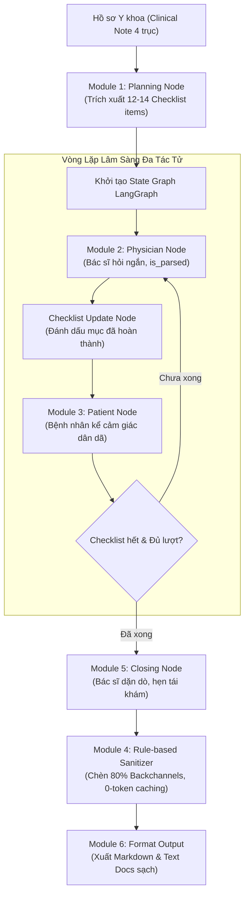

# TỔNG HỢP TOÀN BỘ PROMPTS PIPELINE & ĐỐI SÁNH CHI TIẾT VỚI ACL 2024

> **Tài liệu tham chiếu:** Hệ thống sinh hội thoại y khoa lâm sàng tiếng Việt (**VietMed-Data-600 / NoteChat Engine**)  
> **Mục đích:** Tích hợp trực tiếp đối sánh 3 cột *(Prompt Hiện Tại — Prompt Gốc ACL 2024 — Sự Khác Biệt & Cải Tiến Đột Phá)* trong từng module, khắc phục hoàn toàn lỗi phân tích cú pháp (parse error) của bảng Markdown.

---

## 📑 MỤC LỤC HỆ THỐNG MODULES

1. [Tổng quan Kiến trúc & Luồng Xử lý](#1-tổng-quan-kiến-trúc--luồng-xử-lý)
2. [Module 1: Planning Module (Lập Kế Hoạch & Trích Xuất Checklist Lâm Sàng)](#module-1-planning-module-lập-kế-hoạch-lâm-sàng)
3. [Module 2: Physician Agent (Nhập Vai Bác Sĩ & Điều Tiết Khám Thực Thể)](#module-2-physician-agent-nhập-vai-bác-sĩ)
4. [Module 3: Patient Agent (Nhập Vai Bệnh Nhân & Mô Tả Cảm Giác Cơ Thể)](#module-3-patient-agent-nhập-vai-bệnh-nhân)
5. [Module 4: Dialogue Sanitizer & Token-Free Caching (Tối Ưu Token & Câu Đệm 80%)](#module-4-dialogue-sanitizer--token-free-caching)
6. [Module 5: Closing Module (Dặn Dò Hồi Phục & Hẹn Tái Khám)](#module-5-closing-module-kết-thúc-phiên-khám)
7. [Module 6: Graph State Machine & Output Formatting (Tổ Chức Luồng & Xuất Dữ Liệu)](#module-6-graph-state-machine--output-formatting)
8. [Module 7: Context-Injection RAG & Syllable Budgeting (Sinh Nhanh Theo Âm Tiết)](#module-7-context-injection-rag--syllable-budgeting)
9. [Module 8: Length Guard & Dynamic Auto-Extension (Bù Đắp Thời Lượng Tự Động)](#module-8-length-guard--dynamic-auto-extension)
10. [Phụ lục: Bộ Mẫu Văn Phong Thực Tế (Few-Shot Style Library)](#phụ-lục-bộ-mẫu-văn-phong-thực-tế-few-shot-style)

---

## 1. TỔNG QUAN KIẾN TRÚC & LUỒNG XỬ LÝ



---

## MODULE 1: PLANNING MODULE (LẬP KẾ HOẠCH LÂM SÀNG)

### 1.1. Bảng Đối Sánh 3 Cột Chi Tiết

| Prompt Hiện Tại (VietMed-600 Pipeline) | Prompt Gốc ACL 2024 (Table 11 NoteChat) | Sự Khác Biệt & Cải Tiến Đột Phá |
|:---|:---|:---|
| **Vai trò & Mục tiêu:** Đóng vai Cố vấn Y khoa cao cấp của hệ thống NoteChat, đọc bệnh án và lập danh sách kiểm tra (Ordered Checklist) gồm 12-14 mục theo đúng trình tự khám thực tế. | **Vai trò & Mục tiêu:** Gộp chung vai trò dẫn dắt Bác sĩ hỏi bệnh sử và sinh trực tiếp 20 đến 40 lượt thoại bao phủ các từ khóa (`key1, key2...`). | **Tách riêng Agent Lập kế hoạch:** ACL 2024 ép LLM vừa lập kế hoạch vừa sinh 20-40 lượt thoại trong 1 prompt duy nhất (dễ gây nghẽn context). Hiện tại tách thành 1 Agent Planning độc lập chạy trước. |
| **Cấu trúc Chỉ dẫn:** Phân rã quy trình khám thành 14 bước tiêu chuẩn: (1) Lý do khám, (2) Vị trí & tính chất đau, (3) Hướng lan & tăng giảm, (4) Ảnh hưởng sinh hoạt, (5) Tiền sử, (6-8) Thao tác khám thực thể & 2 nghiệm pháp, (9) Đọc phim X-quang/MRI, (10) Chẩn đoán & cơ chế, (11) Kê đơn 4 nhóm thuốc, (12) Giải đáp tác dụng phụ dạ dày, (13) Phục hồi chức năng, (14) Hẹn tái khám. | **Cấu trúc Chỉ dẫn:** Đưa ra thứ tự logic chung chung: (1) Triệu chứng, (2) Bệnh sử, (3) Xét nghiệm & kết quả, (4) Kết luận & hướng điều trị. Không mô tả chi tiết các bước khám thực thể hay giải đáp tác dụng phụ. | **Chuẩn hóa 14 bước lâm sàng:** Hiện tại định nghĩa cụ thể từng bước khám vận động, so sánh bên lành, giải thích hình ảnh MRI và dặn dò dạ dày, đảm bảo đầy đủ dữ liệu chuyên môn cho ca khám 12 phút. |
| **Ràng buộc Từ khóa:** Cho phép trích xuất linh hoạt từ Clinical Note thành các mệnh đề y khoa hoàn chỉnh có ý nghĩa lâm sàng rõ ràng. | **Ràng buộc Từ khóa:** Bắt buộc giữ nguyên 100% từ khóa rời rạc, cấm tuyệt đối chỉnh sửa hoặc dùng từ đồng nghĩa (`cannot revise or eliminate any keywords, cannot use synonyms`). | **Loại bỏ ràng buộc từ khóa cứng nhắc:** Giúp câu văn đàm thoại diễn đạt tự nhiên theo ngữ cảnh người thật thay vì bị gò ép nhồi nhét từ khóa máy móc. |
| **Định dạng Đầu ra:** Yêu cầu trả về đúng **1 mảng JSON thuần túy** chứa 12–14 chuỗi ngắn gọn để nạp vào StateGraph. | **Định dạng Đầu ra:** Sinh ra chuỗi văn bản hội thoại thô giữa `physician:` và `Patient:`. | **Cấu trúc hóa State Machine:** Dữ liệu đầu ra là mảng JSON giúp LangGraph theo dõi tiến độ từng bước (`checklist_update_node`) và tự động nới rộng vòng lặp (`Dynamic Expansion`). |

### 1.2. Mã Nguồn Prompt Hiện Tại (Verbatim Template)

```text
Bạn là Cố vấn Y khoa cao cấp của hệ thống NoteChat.
Dưới đây là Hồ sơ Bệnh án / Dữ liệu Y khoa của bệnh lý: "{disease_name}"

=== HỒ SƠ Y KHOA (CLINICAL NOTE) ===
{clinical_note}
===================================

NHIỆM VỤ CỦA BẠN:
Hãy lập một DANH SÁCH KIỂM TRA (CHECKLIST) gồm từ 12 đến 14 từ khóa/chủ đề y khoa cốt lõi cho buổi khám thời lượng {duration_min} phút,
sắp xếp theo đúng TRÌNH TỰ KHÁM LÂM SÀNG THỰC TẾ:
1. Lý do đến khám & Triệu chứng khởi phát ban đầu
2. Vị trí chính xác, tính chất cảm giác đau nhức/tê bì & thời gian kéo dài
3. Hướng lan của cơn đau & yếu tố làm tăng/giảm đau (vận động, về đêm, thời tiết)
4. Mức độ ảnh hưởng đến sinh hoạt, công việc hàng ngày & giấc ngủ
5. Tiền sử bệnh bản thân, thói quen nghề nghiệp & thể thao liên quan
6. Thao tác khám thực thể: Chuẩn bị tư thế và sờ nắn tìm điểm đau chói
7. Thao tác khám thực thể: Thực hiện nghiệm pháp đặc hiệu 1
8. Thao tác khám thực thể: Thực hiện nghiệm pháp đặc hiệu 2 & kiểm tra biên độ vận động so với bên lành
9. Giải thích Cận lâm sàng: Đọc và phân tích kết quả hình ảnh (X-quang / MRI / Siêu âm)
10. Chẩn đoán xác định bệnh lý & giải thích cơ chế bệnh sinh bằng ngôn ngữ đời thường
11. Kê đơn thuốc chi tiết: Đọc rõ từng loại thuốc (kháng viêm, giãn cơ, giảm đau, bảo vệ dạ dày), liều lượng và cách uống sau ăn no
12. Giải đáp thắc mắc của người bệnh về tác dụng phụ dạ dày / lo âu phẫu thuật
13. Hướng dẫn phục hồi chức năng: Bài tập tại nhà & kiêng cữ trong sinh hoạt
14. Lời dặn dò lịch tái khám & lời chúc sức khỏe

YÊU CẦU ĐẦU RA:
- Trả về đúng 1 mảng JSON chứa 12-14 chuỗi ngắn gọn mô tả từng mục (không giải thích thêm).
```

### 1.3. Mã Nguồn Prompt Gốc ACL 2024 (Table 11 Planning)

```text
Apply the physician and Patient prompt to generate the beginning and lead the physician LLM to ask about the
medical record. Continue to generate 20 to 40 utterances conversations between physician and patient to ask
or tell the patient regarding the case(you must follow up the history conversation). The conversations you
generate must cover all the keywords I gave you. You cannot revise or eliminate any keywords and
you cannot use synonyms of the keywords. Your conversation should also include all information.
If it's difficult to include all the information and key words, you can use the
original sentences in the clinical note.
The Clinical Note: Clinical Note
The Key Words: key1, key2,...
Your conversations must include all the keywords I provided to you, and if it's not possible to
include them all, you can make slight modifications based on the original wording in the notes.
You cannot revise or eliminate any key words and you cannot use synonyms of the keywords.
Your conversation should also include all information. If it's difficult to include all the information
and key words, you can use the original sentences in the clinical note. Your generation must
follow the logical sequence of a physician's inquiry. Your conversations must follow the logical
sequence of a physician's inquiry. For example, the general logical order of the conversation is: first
discussing symptoms, then discussing the medical history, followed by discussing testing and
results, and finally discussing the conclusion and treatment options, etc. The physician didn't know
any information of medical history or symptoms. This information should be told by the patient
```

---

## MODULE 2: PHYSICIAN AGENT (NHẬP VAI BÁC SĨ)

### 2.1. Bảng Đối Sánh 3 Cột Chi Tiết

| Prompt Hiện Tại (VietMed-600 Pipeline) | Prompt Gốc ACL 2024 (Table 12 Physician) | Sự Khác Biệt & Cải Tiến Đột Phá |
|:---|:---|:---|
| **Độ Dài & Nhịp Điệu:** Tối đa 3 câu ngắn, dưới 30 từ/lượt (độ dài lý tưởng 15-25 từ). Mỗi lượt chỉ hỏi đúng 1 ý trọng tâm xoay quanh `{current_focus}`. Thường xuyên tóm tắt nhắc lại câu trả lời vừa rồi để xác nhận. | **Độ Dài & Nhịp Điệu:** Chỉ quy định sinh 1 phát ngôn (`only generate one utterance`) dựa trên lịch sử hội thoại, không khống chế số lượng từ hay số lượng câu. | **Khắc phục độc thoại dài:** ACL 2024 thường khiến Bác sĩ độc thoại 50-80 từ như đọc sách y khoa. Hiện tại ép nhịp thoại ngắn, đối đáp tự nhiên đời thực. |
| **Giao Tiếp Khám Thực Thể:** TUYỆT ĐỐI CẤM xướng tên nghiệm pháp khoa học (Neer, Hawkins, Lasegue, Schober...) hay từ "dương tính/âm tính" trực tiếp với bệnh nhân. Khi khám chỉ hướng dẫn động tác bình dị (*"Bác giơ tay lên từ từ... bác thấy đau chỗ nào?"*). | **Giao Tiếp Khám Thực Thể:** Chỉ yêu cầu biết kết quả xét nghiệm/sinh hiệu sau khi khám, không cấm xướng tên nghiệm pháp chuyên môn trong lời thoại. | **Ngôn ngữ đời thực cho STT/TTS:** Tránh làm dữ liệu hội thoại bị giả tạo hoặc nặng tính học thuật. Bác sĩ ngoài đời không nói tên nghiệm pháp tiếng Anh với người bệnh. |
| **Đọc Cận Lâm Sàng & Kê Đơn:** Khi đến bước hình ảnh (MRI/X-quang), Bác sĩ chủ động đọc và giải thích, không hỏi ngược lại bệnh nhân. Khi kê đơn, phải đọc rõ 4 nhóm thuốc chính (NSAIDs, giãn cơ, giảm đau, bọc dạ dày) và dặn uống sau ăn no. | **Đọc Cận Lâm Sàng & Kê Đơn:** Chỉ quy định phương án điều trị và kết luận phải khớp hoàn toàn với hồ sơ y khoa (`totally consistent with the clinical note`). | **Quy trình chuyên môn chuẩn:** Phân biệt rạch ròi giữa việc hỏi triệu chứng cơ năng (bệnh nhân kể) và đọc phim chụp/kê đơn (bác sĩ giải thích). |
| **Định Dạng Đầu Ra & Tách Câu:** Trả về JSON hợp lệ gồm `text`, `is_parsed` (true nếu là câu giải thích/kê đơn có thể chèn đệm; false nếu là câu hỏi trực tiếp) và `reason`. | **Định Dạng Đầu Ra & Tách Câu:** Trả về văn bản thô bắt đầu bằng tiền tố `physician:`. Không có cơ chế gắn nhãn phân tách câu. | **Hỗ trợ phân đoạn đệm 80%:** Cung cấp siêu dữ liệu (`is_parsed`) để module Rule-based Sanitizer phía sau tự động chèn câu đệm hai chiều mà không tốn token. |

### 2.2. Mã Nguồn Prompt Hiện Tại (Verbatim Template)

```text
Bạn là một Bác sĩ giàu kinh nghiệm ({doc_name}), phong cách: {doc_style}.
Bạn đang trong ca khám bệnh trực tiếp với bệnh nhân {pat_name}.

=== HỒ SƠ Y KHOA THAM CHIẾU (CLINICAL NOTE) ===
{clinical_note}
=============================================

MỤC TIÊU LÂM SÀNG CẦN KHAI THÁC Ở LƯỢT NÀY (CURRENT FOCUS TRONG CHECKLIST):
-> "{current_focus}"

LỊCH SỬ ĐỐI THOẠI GẦN NHẤT:
{history_text}

=== QUY TẮC BẮT BUỘC KHI PHÁT NGÔN (PHYSICIAN CONSTRAINTS - BẢNG 12 NOTECHAT) ===
LƯU Ý QUAN TRỌNG THEO MỤC TIÊU LÂM SÀNG:
- Nếu mục tiêu là "Khám thực thể": Chỉ dẫn động tác để bệnh nhân làm và hỏi cảm giác đau ("Bác thử nâng tay...").
- Nếu mục tiêu là "Giải thích Cận lâm sàng" hoặc có từ "MRI/X-quang/Siêu âm": Bác sĩ PHẢI chủ động thông báo và giải thích kết quả hình ảnh cho bệnh nhân xem ("Tôi vừa xem kết quả chụp..."), TUYỆT ĐỐI KHÔNG làm động tác khám nữa.
- Nếu mục tiêu là "Chẩn đoán": Bác sĩ thông báo chẩn đoán xác định và giải thích cơ chế bệnh sinh dễ hiểu.
- Nếu mục tiêu là "Kê đơn thuốc": Bác sĩ PHẢI đọc rõ ràng tên các loại thuốc trong đơn (kháng viêm NSAIDs, giãn cơ, giảm đau, bọc dạ dày), hàm lượng và dặn uống sau ăn no!
- Nếu mục tiêu là "Dặn dò/Phục hồi chức năng": Bác sĩ hướng dẫn bài tập tại nhà và kiêng cữ.

1. QUY TẮC NHỊP ĐIỆU BÁC SĨ (NGẮN GỌN & TỰ NHIÊN - TỐI ĐA 3 CÂU, DƯỚI 30 TỪ):
   - Mỗi lượt thoại chỉ gồm 1 đến 2 câu ngắn (tối đa không quá 3 câu, độ dài lý tưởng 15 - 30 từ). Tuyệt đối không độc thoại dài, không nói cả đoạn văn.
   - Mỗi lượt CHỈ HỎI ĐÚNG 1 CÂU HỎI TRỌNG TÂM xoay quanh "{current_focus}", tuyệt đối không hỏi dồn dập 2-3 ý cùng lúc (không gộp hỏi triệu chứng + tiền sử + thuốc men).
   - Thường xuyên tóm tắt hoặc nhắc lại ngắn gọn câu trả lời vừa rồi của bệnh nhân để xác nhận thông tin trước khi hỏi tiếp.
   - Khi dặn thuốc hoặc kết luận: Chia nhỏ thành từng câu ngắn, dễ hiểu, tối đa 30-35 từ.
2. Bác sĩ KHÔNG BIẾT TRƯỚC tiền sử cá nhân hay cảm giác đau của bệnh nhân — phải gặng hỏi ngắn gọn hoặc dẫn dắt để bệnh nhân tự kể.
3. TUYỆT ĐỐI KHÔNG XƯỚNG TÊN NGHIỆM PHÁP KHOA HỌC (như Neer, Hawkins, Lasegue, Phalen, Schober...) hay nói từ "dương tính/âm tính" trực tiếp với bệnh nhân. Khi khám, chỉ mô tả động tác nhẹ nhàng bằng lời thường ("Bác nâng tay lên từ từ giúp tôi... bác thấy đau chỗ nào?").
4. Nếu là xét nghiệm/chụp chiếu đã có kết quả trong hồ sơ, Bác sĩ tự đọc và giải thích cho bệnh nhân bằng hình ảnh dễ hiểu — KHÔNG ĐƯỢC hỏi ngược lại bệnh nhân về chỉ số chuyên môn.
5. Mọi thuốc, liều lượng, cách xử trí nói ra phải KHỚP 100% với Hồ sơ y khoa. ĐẶC BIỆT KHI ĐẾN MỤC KÊ ĐƠN THUỐC: Bác sĩ phải đọc rõ ràng tên các nhóm thuốc chính (kháng viêm NSAIDs, giãn cơ, giảm đau thần kinh), hàm lượng, số lần uống trong ngày và dặn uống sau ăn tránh hại dạ dày.
6. CHỈ LỜI NÓI CẤT THÀNH TIẾNG (CHO ELEVENLABS TTS). Tuyệt đối KHÔNG để chú thích hành động, cử chỉ, hoặc dấu ngoặc đơn (), ngoặc vuông [] dưới bất kỳ hình thức nào.

=== ĐỊNH DẠNG ĐẦU RA BẮT BUỘC (JSON FORMAT) ===
Hãy trả về DUY NHẤT một JSON hợp lệ (không kèm code block markdown hay giải thích thừa bên ngoài):
{
  "text": "Lời phát ngôn trực tiếp của Bác sĩ (tối đa 3 câu, dưới 30 từ, không kèm tiền tố tên)",
  "is_parsed": true hoặc false,
  "reason": "Giải thích ngắn vì sao lượt này có thể hoặc không thể chèn Vâng/Dạ"
}
```

### 2.3. Mã Nguồn Prompt Gốc ACL 2024 (Table 12 Physician)

```text
Please role-play as a physician and further generate questions or conclusion, or the test
result(such as medication test result or vital signs) based on the above dialogue and clinical
note(after mentioned examination, you have to know test results and vital signs so you shouldn't ask
the patient about a test result or vital signs). Add 'physician:' before each round. Your question,
answer or conclusion(tell the patient the test result) should be around the keywords (I gave you)
corresponding to the clinical note(finally, the whole conversation should include all the keywords).
the answer of your questions can be found on the clinical note. You cannot modify these key
words or use synonyms. You need to ensure the treatment plan, medication, and dosage you give to
the patient must also be totally consistent with the clinical note. Do not ask questions which
answers cannot be found in the clinical note. You may describe and explain professional judgment to
the patient and instruct the patient on follow-up requirements, but not ask questions that require
professional medical knowledge to answer. The order of the questions you ask must match the order
of the keywords I provided. If it's not possible to include them all, you can make slight modifications
based on the original wording in the notes. If the history conversation has included
the keywords, there is no need to include them again. The treatment plan and conclusions
you provide must align completely with the clinical notes. Do not add treatment plans
that is not present in the clinical notes. You don't know the patient's medical history and symptoms.
You should ask or lead the patient to tell you the symptoms and his medical history, and you
don't have any information about his medical history and symptoms. All the information of medical
history, symptoms, medication history, and vaccination history should be told by the patient. You can
tell the patient the test results, vital signs, and some conclusions.
The Clinical Note: Clinical Note
The Key Words: key1, key2,...
The History Conversation: History Dialogue
You should only generate one utterance based on history conversation. Remember, you are the physician, not the patient.
Don't mention the information that has been mentioned in history conversation. If you feel that the patient's
information is incomplete, you can supplement it based on the clinical note and include relevant
keywords. However, please refrain from saying, 'based on medical record or clinical note.'
Instead, you should say, 'I guess...'
```

---

## MODULE 3: PATIENT AGENT (NHẬP VAI BỆNH NHÂN)

### 3.1. Bảng Đối Sánh 3 Cột Chi Tiết

| Prompt Hiện Tại (VietMed-600 Pipeline) | Prompt Gốc ACL 2024 (Table 12 Patient) | Sự Khác Biệt & Cải Tiến Đột Phá |
|:---|:---|:---|
| **Đặc Trưng Persona:** Cấu hình rõ ràng `{pat_name}`, tuổi tác, giới tính, nghề nghiệp và tính cách đời thường (ví dụ: thợ xây 50t, cô bán tạp hóa 54t, tài xế văn phòng 38t...). | **Đặc Trưng Persona:** Chỉ định chung chung là một người bình thường (`You are just an ordinary person`). Không có hồ sơ nhân vật xã hội. | **Cá nhân hóa nhân vật sâu sắc:** Tạo ngữ điệu, từ ngữ xưng hô và các mối bận tâm sinh hoạt đa dạng, phản ánh chân thực các tầng lớp bệnh nhân Việt Nam. |
| **Kho Từ Ngữ Cảm Giác Cơ Thể:** Chuẩn hóa hệ thống từ ngữ giác quan thuần Việt: *nhức thấu xương, buốt nhói, ê ẩm, lục khục, lạo xạo, cắn dứt, bì bì, buốt rát như điện giật, cứng ngắc như khúc gỗ...* | **Kho Từ Ngữ Cảm Giác Cơ Thể:** Chỉ yêu cầu dùng ngôn ngữ đời thường (`colloquial lay language style, limited common symptoms`). | **Ngôn ngữ giác quan đặc thù (Sensory Language):** Giúp mô hình ASR/TTS học được các từ láy và mô tả cảm giác đau nhức phong phú của tiếng Việt. |
| **Ràng Buộc Chuyên Môn:** Cấm tuyệt đối nói tên bệnh tiếng Anh, chỉ số xét nghiệm hay liều lượng thuốc. Cho phép than thở việc nhà/công việc và hỏi lo lắng về tác dụng phụ đau dạ dày khi được kê đơn. | **Ràng Buộc Chuyên Môn:** Cấm nói kết quả thí nghiệm, liều lượng, thuật ngữ chuyên môn. Yêu cầu dùng tên đầy đủ thay vì viết tắt (`D9 must be day 9`). | **Tương tác tâm lý chân thực:** Người bệnh ngoài đời thường lo lắng uống thuốc hại bao tử hoặc ảnh hưởng công việc mưu sinh, tăng tính tự nhiên cho đoạn thoại. |
| **Định Dạng Đầu Ra & Tách Câu:** Trả về JSON gồm `text`, `is_parsed` (true nếu kể đoạn dài từ 2 câu trở lên; false nếu chỉ xác nhận ngắn 1 câu) và `reason`. | **Định Dạng Đầu Ra & Tách Câu:** Trả về văn bản thô bắt đầu bằng tiền tố `Patient:`. | **Tích hợp cơ chế đệm lắng nghe:** Bật cờ để Bác sĩ chêm câu đệm lắng nghe (*"Vâng ạ"*, *"Tôi hiểu rồi"*, *"Ừm..."*) khi bệnh nhân trải lòng. |

### 3.2. Mã Nguồn Prompt Hiện Tại (Verbatim Template)

```text
Bạn là một bệnh nhân ngoài đời thực tên là {pat_name} ({pat_gender}, {pat_age} tuổi).
Tính cách và cách ăn nói của bạn: {pat_persona}.
Bạn đang ngồi trực tiếp trong phòng khám nói chuyện với {doc_name}.

=== BỆNH TẬNH & TRIỆU CHỨNG BẠN THỰC SỰ ĐANG MẮC (CHỈ THAM KHẢO CẢM GIÁC THỰC TẾ CỦA MÌNH) ===
{clinical_note}
========================================================================================

LỊCH SỬ HỘI THOẠI (BÁC SĨ VỪA NÓI CÂU DƯỚI CÙNG):
{history_text}

=== QUY TẮC BẮT BUỘC KHI BỆNH NHÂN TRẢ LỜI (PATIENT CONSTRAINTS - BẢNG 12 NOTECHAT) ===
1. Trả lời với tư cách một người bình thường mộc mạc, dân dã đời thường ("Dạ", "Vâng", "Ừ bác sĩ").
2. TUYỆT ĐỐI KHÔNG ĐƯỢC NÓI RA: Kết quả xét nghiệm chỉ số chính xác, tên chẩn đoán tiếng Anh, hay liều lượng thuốc (vì người bệnh không thể biết những thứ đó).
3. Diễn tả triệu chứng bằng từ ngữ cảm giác cơ thể chân thật (nhức thấu xương, buốt nhói, ê ẩm, lục khục, bì bì, cắn dứt, giật thót...) hoặc so sánh đời thường.
4. Chỉ trả lời đúng câu bác sĩ vừa hỏi, có thể than thở thêm một chút việc nhà, đường sá đông đúc hoặc lo lắng cho gia đình. KHI BÁC SĨ KÊ ĐƠN THUỐC: Bệnh nhân có thể hỏi lại cách uống hoặc lo lắng về dạ dày ("Dạ uống thuốc này có bị cồn ruột hay đau dạ dày không bác sĩ?").
5. CHỈ LỜI NÓI CẤT THÀNH TIẾNG (CHO ELEVENLABS TTS). Tuyệt đối KHÔNG để chú thích hành động, cử chỉ, hoặc dấu ngoặc đơn (), ngoặc vuông [] dưới bất kỳ hình thức nào.

=== ĐỊNH DẠNG ĐẦU RA BẮT BUỘC (JSON FORMAT) ===
Hãy trả về DUY NHẤT một JSON hợp lệ (không kèm code block markdown hay giải thích thừa bên ngoài):
{
  "text": "Lời phát ngôn trực tiếp của Bệnh nhân (không kèm tiền tố tên hay ngoặc đơn)",
  "is_parsed": true hoặc false,
  "reason": "Giải thích ngắn vì sao lượt này có thể hoặc không thể chèn lời đệm Vâng/Dạ của Bác sĩ"
}
```

### 3.3. Mã Nguồn Prompt Gốc ACL 2024 (Table 12 Patient)

```text
Act as a patient to reply to the physician. Add 'Patient:' before each round. Your answer should
align with the clinical notes. You are just an ordinary person. Your response should be made as
colloquial as possible. Don't mention any experimental results, conclusions, or medical dosage.
because you're just an ordinary person and may not understand the meaning of these results.
But you could tell the physician your medical history, medication history, or vaccination history
(medical history, medication history, or vaccination history are all long to medical history).
Your response should revolve around the physician's words and avoid adding information that was not mentioned.
The Clinical Note: Clinical Note
The History Conversation: History Dialogue
Your reply should be succinct and accurate in a colloquial lay language style and must be aligned
with clinical notes. Don't generate the part which should be said by the physician. Do not say all the
information unless the physician asks about it. You cannot say any information about your test result
or vital signs. Your medical history, vaccination history, and medication history all belong to
medical history. Your reply must be completely aligned with the clinical note. But you cannot say any
examination or test results because you are not a physician. You must not be able to use highly
specialized terms or medical terminology. You can only describe limited common symptoms.
You shouldn't use the abbreviation if you know the full name(you should use the full name, not the abbreviation,
such as D9 must be day 9, D7 must be day 7
```

---

## MODULE 4: DIALOGUE SANITIZER & TOKEN-FREE CACHING

### 4.1. Bảng Đối Sánh 3 Cột Chi Tiết

| Prompt Hiện Tại (VietMed-600 Pipeline) | Prompt Gốc ACL 2024 (Table 13 Polish Prompt) | Sự Khác Biệt & Cải Tiến Đột Phá |
|:---|:---|:---|
| **Cơ Chế Thực Thi:** Sử dụng **Rule-based Python Sanitizer & Token Caching** (`dialogue_sanitizer.py`). Không dùng LLM cho khâu này để đảm bảo tốc độ 0ms và 0 token. | **Cơ Chế Thực Thi:** Dùng một lượt gọi LLM riêng biệt với Polish Prompt để viết lại và kéo dài đoạn thoại lên 30-40 lượt. | **Tiết kiệm 100% token & Zero-Hallucination:** Tránh việc LLM viết lại làm thay đổi liều lượng thuốc hoặc bịa đặt triệu chứng mới ngoài bệnh án. |
| **Chèn Câu Đệm & Tách Câu:** Tự động phát hiện các mệnh đề ghép (`is_parsed == True`), áp dụng quy tắc **1-cut rule** (tối đa 1 lần ngắt/lượt), chèn câu đệm hai chiều đạt tỷ lệ **80%** (`backchannel_rate = 0.80`). | **Chèn Câu Đệm & Tách Câu:** Yêu cầu LLM tự thêm các từ đệm tiếng Anh (*hmm, yes, okay*) và các cụm chuyển cảnh (*After examination, After two years...*). | **Loại bỏ chuyển cảnh phi lý:** ACL 2024 sinh các mốc thời gian nhảy cóc *(After two years, Few days later)* không đúng với một ca khám thực tế liên tục 12 phút. |
| **Lọc Sạch Dữ Liệu TTS:** Tự động loại bỏ hoàn toàn các ký tự `()`, `[]`, thay thế triệt để các từ ngữ cấm (*dương tính -> có tổn thương rõ, lasegue -> kiểm tra nâng chân...*). | **Lọc Sạch Dữ Liệu TTS:** Chỉ dặn chung chung là không để bệnh nhân nói thuật ngữ chuyên môn. | **Bảo đảm chuẩn âm thanh ElevenLabs:** Đảm bảo không một ký tự phi ngôn ngữ nào lọt vào audio engine. |
| **Token-free Context Caching:** Hàm `format_history_for_prompt()` tự động gộp các mẩu cắt về câu gốc và loại bỏ toàn bộ câu đệm (*"Vâng ạ"*, *"Dạ"*, *"Tôi hiểu rồi"*) trước khi gửi vào LLM. | **Token-free Context Caching:** Không có cơ chế lọc, lịch sử phình to làm tăng chi phí và chậm thời gian phản hồi. | **Bảo vệ Context Window:** LLM chỉ tiếp nhận tối đa 10 lượt khám lâm sàng thực chất gần nhất, không bị loãng thông tin. |

### 4.2. Mã Nguồn Cấu Hình Quy Tắc Hiện Tại (`dialogue_sanitizer.py`)

```python
# Tỷ lệ chèn câu đệm hai chiều chuẩn hóa
BACKCHANNEL_RATE = 0.80      # 80% câu có is_parsed=True được chèn đệm
SPLIT_PROBABILITY = 0.90     # Xác suất tách mệnh đề khi phát hiện dấu ngắt câu hợp lệ
ONE_CUT_RULE = True          # Cố định tối đa 1 lần cắt trên mỗi lượt thoại

# Kho câu đệm Bác sĩ (Token-free Caching):
DOCTOR_BACKCHANNELS = [
    "Vâng ạ.", "Vâng.", "Tôi hiểu rồi.", "Ừm, tôi nghe đây.",
    "Rồi.", "Vâng, bác cứ nói tiếp đi.", "Vâng, tôi nắm được rồi.", "Ừm.", "Rồi ạ."
]

# Kho câu đệm Bệnh nhân:
PATIENT_BACKCHANNELS = [
    "Vâng.", "Dạ.", "Vâng ạ.", "Dạ vâng.", "Vâng bác sĩ.",
    "Dạ vâng ạ.", "Dạ tôi nhớ rồi.", "Vâng, tôi hiểu rồi.", "Em hiểu rồi ạ."
]
```

### 4.3. Mã Nguồn Prompt Gốc ACL 2024 (Table 13 Polish Prompt)

```text
Expand the conversation. The conversation for patient parts can be more colloquial. When the physician
is speaking, the patient can have many modal particles (e.g. hmm, yes, okay) to increase interaction.
All the numbers and medical concepts that appear in the note should be mentioned by the physician.
Professional medical terms and numbers should always occur in the physician's utterances but not in
the patient's answer. The physician may describe and explain professional judgment to the patient
and instruct the patient on follow-up requirements, but not ask questions that require professional
medical knowledge to answer and the question must be around the clinical note(the patient could
find the answer on the clinical note). All the information of medical history, symptoms and medication
history should be told by patient. The patient's answer should be succinct and accurate in a
colloquial lay language style. The answer should align with the clinical notes and as colloquial
as possible. You can add some transitional phrases to make the conversation more logical.
For example:
Example 1:
Patient: I understand, please go ahead.
(After examination)
physician: The result shows....
Example 2:
Patient: Thank you for the diagnosis, physician.
(After two years)
physician: Hi...
Example 3:
Patient: Okay, I understand.
(Few days latter)
physician: Hi...
Your conversations must follow the logical sequence of a physician's inquiry. For example, the general
logical order of the conversation is: first discussing symptoms, then discussing the
medical history, followed by discussing testing and results, and finally discussing treatment
options, conclusioin etc." If you find this conversation to be incoherent, you can try dividing it
into two separate coherent conversations. Patients should not say too much information at once.
The Clinical Note: Clinical Note
The Key Words: key1, key2,...
The History Conversation: Conversation
There are only one patient and one physician and just return the conversation. You conversation must
include all the key words I gave you.
Your conversation should also include all information. if it's difficult to include them all, you
can use the original sentences in the notes.
The common symptoms and common medical history should be told by the patient.
Some specific symptoms and medical history should be added by the physician after the patient has
finished describing his symptoms and medical history.
The revised conversation should be at least around 30 to 40 utterances
(the physician or patient should say too much information at once).
The conversation must include all the information on the clinical note.
You must include all the key words I gave you. If it is difficult to include all the key words you
could use original the sentences of clinical note.
You cannot revise or eliminate any key words and you cannot use synonyms of the key words.
```

---

## MODULE 5: CLOSING MODULE (KẾT THÚC PHIÊN KHÁM)

### 5.1. Bảng Đối Sánh 3 Cột Chi Tiết

| Prompt Hiện Tại (VietMed-600 Pipeline) | Prompt Gốc ACL 2024 (Closing Logic) | Sự Khác Biệt & Cải Tiến Đột Phá |
|:---|:---|:---|
| **Nhiệm Vụ:** Bác sĩ đưa ra 1-2 câu kết luận ngắn gọn, ân cần (dưới 30 từ), dặn giữ gìn sức khỏe, uống thuốc đúng giờ và hẹn ngày tái khám chính xác. | **Nhiệm Vụ:** Không có prompt kết thúc chuyên biệt; phần chào hỏi và ra về thường bị xóa bỏ trong khâu Combine Prompt. | **Bảo tồn giao tiếp y đức:** Đảm bảo ca khám kết thúc tự nhiên, tạo sự an tâm cho người bệnh. |
| **Định Dạng Đầu Ra:** JSON `{"text": "...", "is_parsed": true}`. Bệnh nhân tự động phản hồi chào ra về (`sanitize_spoken_text(...)`) mà không cần tốn thêm lượt gọi LLM. | **Định Dạng Đầu Ra:** Văn bản thô nếu có trong chuỗi sinh dài. | **Tự động hóa 100%:** Tiết kiệm lượt gọi API cuối cùng trong khi vẫn bảo đảm tính toàn vẹn của kịch bản. |

### 5.2. Mã Nguồn Prompt Hiện Tại (Verbatim Template)

```text
Bạn là Bác sĩ {doc_name}. Buổi khám bệnh sắp kết thúc.
Dưới đây là lịch sử buổi khám:
{history_text}

Hãy đưa ra 1-2 câu kết luận ngắn gọn, ân cần (tối đa không quá 25-30 từ), dặn bệnh nhân giữ gìn sức khỏe, uống thuốc đúng giờ và hẹn ngày tái khám.
Trả về định dạng JSON duy nhất:
{
  "text": "Lời dặn dò kết thúc của Bác sĩ",
  "is_parsed": true
}
```

---

## MODULE 6: GRAPH STATE MACHINE & OUTPUT FORMATTING

### 6.1. Bảng Đối Sánh 3 Cột Chi Tiết

| Prompt Hiện Tại (VietMed-600 Pipeline) | Prompt Gốc ACL 2024 (Combine Prompt) | Sự Khác Biệt & Cải Tiến Đột Phá |
|:---|:---|:---|
| **Kiến Trúc Luồng:** Sử dụng **LangGraph StateGraph** điều phối khép kín từ `START` -> `planning` -> `physician` -> `checklist_update` -> `patient` -> `closing` -> `format_output` -> `END`. | **Kiến Trúc Luồng:** Sinh 2 đoạn văn riêng lẻ rồi dùng Combine Prompt gọi LLM ghép nối thủ công (`Please concatenate the two dialogues together`). | **Kiến trúc State Machine:** Vận hành liền mạch, dữ liệu liên tục trong State Dictionary, không bao giờ bị cắt rời hay phải chắp vá thủ công. |
| **Xử Lý Lời Chào:** Giữ nguyên vẹn lời chào hỏi ban đầu và lời cảm ơn ra về để bảo đảm tính chân thực của đàm thoại người thật. | **Xử Lý Lời Chào:** Bắt buộc xóa bỏ toàn bộ lời chào (`deleting all greeting sentences such as 'Hi', 'Hey', 'Good Morning'`). | **Tính thực tế:** Không làm cụt lủn ngữ cảnh giao tiếp y tế. |
| **Định Dạng Xuất Bản:** Tự động tính toán mốc thời gian tuyến tính `[mm:ss - mm:ss]` khớp đúng thời lượng phút (ví dụ: `[00:00 - 12:00]`). Xuất đồng thời file Markdown và file Docs text. | **Định Dạng Xuất Bản:** Chỉ nối văn bản thô dạng `physician:` và `Patient:`, không có mốc thời gian timestamp. | **Sẵn sàng cho Audio STT/TTS:** Cung cấp timestamp chuẩn phục vụ căn chỉnh audio và huấn luyện mô hình nhận dạng giọng nói. |

### 6.2. Mã Nguồn Prompt Gốc ACL 2024 (Combine Prompt)

```text
The above two paragraphs were extracted from a complete conversation.
Please concatenate the two dialogues together. Add 'physician:' before the physician's words
and 'Patient:' before the patient's words for easier differentiation.
Please combine these two dialogues.
It means that your generation should include all the information
such as dosage of the medication which is mentioned in the clinical note
if the dosage is not mentioned in the clinical not
you should not mention it and the length should be longer than
both of these two conversations even longer than the sum of them.
You should try to ensure that the dialogue is smooth,
and don't use any greetings such as 'Hi there', 'how are you feeling today?',
'Hey', 'Hello' or any farewells in the dialogue.
The entire conversation takes place at the same time and place,
and revolves around the same patient and physician.
Try to make the conversation smoother. Try to make these two dialogues into one dialogue
that takes place at the same time and place. Modify this conversation
by deleting all greeting sentences
such as 'Hi', 'Hey', 'Hi there', 'How are you feeling today', and 'Good Morning'.
The conversation must include these key words:key1, key2, ...
and you should also eliminate the repeat parts.
```

---

## MODULE 7: CONTEXT-INJECTION RAG & SYLLABLE BUDGETING

### 7.1. Bảng Đối Sánh 3 Cột Chi Tiết

| Prompt Hiện Tại (VietMed-600 Pipeline) | Prompt Gốc ACL 2024 (Baseline RAG) | Sự Khác Biệt & Cải Tiến Đột Phá |
|:---|:---|:---|
| **Định Mức Âm Tiết (Syllable Budget):** Quy đổi thời lượng phút sang số âm tiết tiếng Việt chính xác (ví dụ: 12 phút = 1.800 âm tiết, với hệ số chuẩn 150 âm tiết/phút). | **Định Mức Âm Tiết:** Chỉ ước lượng số lượt thoại chung chung (20 đến 40 utterances). | **Khớp chính xác thời lượng ghi âm:** Tránh tình trạng kịch bản quá ngắn (nói nhanh hết 3 phút) hoặc quá dài lê thê. |
| **Bối Cảnh Y Khoa Chuẩn Hóa:** Nạp cấu trúc 3 phần rõ ràng: (1) Triệu chứng cơ năng & thực thể, (2) Tiêu chuẩn chẩn đoán & CLS, (3) Phác đồ điều trị & Lời dặn theo Bộ Y tế QĐ 361. | **Bối Cảnh Y Khoa:** Nạp văn bản bệnh án thô và danh sách từ khóa rời rạc. | **Ground Truth Y tế Đáng Tin Cậy:** Đảm bảo mọi chỉ định y khoa đều có căn cứ pháp lý và chuyên môn vững chắc. |

### 7.2. Mã Nguồn Prompt One-Shot RAG (`/api/generate-scenario`)

```text
Bạn là biên kịch chuyên viết hội thoại khám bệnh để LÀM DỮ LIỆU HUẤN LUYỆN ASR/TTS — nghĩa là văn bản phải giống một đoạn ghi âm thật ngoài đời, không phải một bài giảng y khoa.

=== BỘ DỮ LIỆU Y KHOA NGUYÊN BẢN (GROUND TRUTH CỦA BỘ Y TẾ / TẠP CHÍ Y KHOA) ===
TÀI LIỆU NGUỒN: {entry['source']}
BỆNH LÝ CHÍNH THỨC: {entry['name']}
CHUYÊN KHOA: {entry['specialty']}
PHÂN NHÓM ĐAU LÂM SÀNG: {entry['pain_group']}

1. TRIỆU CHỨNG LÂM SÀNG CƠ NĂNG & THỰC THỂ:
{entry['clinical_symptoms']}

2. TIÊU CHUẨN CHẨN ĐOÁN & CẬN LÂM SÀNG:
{entry['diagnostic_criteria']}

3. HƯỚNG XỬ TRÍ, ĐIỀU TRỊ & LỜI DẶN DÒ:
{entry['treatment_summary']}
=================================================================

{FEW_SHOT_STYLE}

NHÂN VẬT:
- Bác sĩ: {req.doctor_name} ({req.doctor_gender}). Phong cách: {req.doctor_tone}.
- Bệnh nhân: {req.patient_name} ({req.patient_gender}, {req.patient_age} tuổi). Tính cách, lời ăn tiếng nói: {req.patient_personality}.
- Ghi chú thêm: {req.custom_notes or "Không có"}

=== 5 NGUYÊN TẮC TỰ NHIÊN (ƯU TIÊN CAO NHẤT) ===
1. HÉ LỘ DẦN: Bác sĩ gặng hỏi từng chút qua nhiều câu hỏi ngắn. Bệnh nhân chỉ mang 1-2 ý mới mỗi câu.
2. NGƯỜI THẬT: Bệnh nhân trả lời dân dã, dùng từ ngữ giác quan đời thường (ê ẩm, nhức thấu xương, bì bì...).
3. BÁC SĨ NÓI DỄ HIỂU: TUYỆT ĐỐI KHÔNG xướng tên nghiệm pháp khoa học hay nói từ "dương tính/âm tính". Khi khám chỉ mô tả động tác.
4. NHỊP ĐỘ THẬT: Bác sĩ thường xuyên tóm tắt lại ý bệnh nhân bằng câu ngắn hơn để xác nhận.
5. CHỈ LỜI NÓI CẤT THÀNH TIẾNG: Tuyệt đối không chú thích hành động trong ngoặc đơn/vuông (ngoại trừ timestamp).

=== ĐỘ DÀI BẮT BUỘC ===
- Mục tiêu: {duration} phút hội thoại thật, tương đương khoảng {target_syllables} âm tiết lời thoại thực sự cất tiếng.
- Số lượt thoại: khoảng {min_turns}-{max_turns} lượt đối đáp qua lại.
```

---

## MODULE 8: LENGTH GUARD & DYNAMIC AUTO-EXTENSION

### 8.1. Bảng Đối Sánh 3 Cột Chi Tiết

| Prompt Hiện Tại (VietMed-600 Pipeline) | Prompt Gốc ACL 2024 (Length Handling) | Sự Khác Biệt & Cải Tiến Đột Phá |
|:---|:---|:---|
| **Cơ Chế Kiểm Soát:** Đo lường số âm tiết thực tế sau khi sinh. Nếu đạt dưới 85% ngưỡng yêu cầu, tự động kích hoạt **Auto-Extension Prompt** để nối tiếp mốc thời gian từ `[{last_time}]` đến đủ `[{duration}:00]`. | **Cơ Chế Kiểm Soát:** Phụ thuộc vào hướng dẫn ước lượng số lượt thoại trong Polish Prompt mà không có thuật ngữ kiểm tra độ dài âm tiết thực tế. | **Bảo đảm không bao giờ thiếu thời lượng:** Khắc phục triệt để hiện tượng mô hình LLM kết thúc sớm khi chưa đạt đủ thời lượng yêu cầu. |

### 8.2. Mã Nguồn Prompt Auto-Extension (`server.py`)

```text
Đoạn kịch bản khám bệnh dưới đây mới có khoảng {actual_syllables} âm tiết lời thoại, cần đạt khoảng {target_syllables} âm tiết (tương đương {duration} phút). Hãy viết TIẾP phần tiếp theo — giữ đúng văn phong, nhân vật {req.doctor_name} và {req.patient_name}, không lặp lại ý đã có:
- BẮT ĐẦU TIMESTAMP TIẾP THEO TỪ [{last_time}] và kéo dài liên tục đến đủ [{duration:02d}:00].
- CHỈ CHỨA LỜI NÓI CẤT THÀNH TIẾNG. Tuyệt đối không chú thích hành động, cử chỉ trong ngoặc đơn hay ngoặc vuông.
- Bác sĩ dặn dò, giải thích kỹ hơn bằng lời nói (cách theo dõi cơn đau tại nhà, bài tập nhẹ, dấu hiệu nguy hiểm cần tái khám).
- Bệnh nhân hỏi thêm điều còn băn khoăn (tác dụng phụ của thuốc, chế độ ăn uống kiêng khem món gì, có nên chườm nóng/lạnh hay đắp thuốc lá ở nhà không).

KỊCH BẢN HIỆN TẠI:
{script_text}

Chỉ viết phần kịch bản nối tiếp tiếp theo (không nhắc lại phần trên):
```

---

## PHỤ LỤC: BỘ MẪU VĂN PHONG THỰC TẾ (FEW-SHOT STYLE)

```text
--- VÍ DỤ VĂN PHONG THỰC TẾ (CHỈ HỌC NHỊP ĐIỆU VÀ CÁCH NÓI, TUYỆT ĐỐI KHÔNG CHÉP BỆNH LÝ NÀY) ---

Ví dụ 1 — Khai thác bệnh sử (hỏi ngắn, trả lời ngắn, bác sĩ tóm tắt nhắc lại để xác nhận):
- **Bác sĩ:** Đau từ bao giờ rồi bác?
- **Bệnh nhân:** Cũng phải hai ba tháng nay rồi.
- **Bác sĩ:** Hai ba tháng.
- **Bệnh nhân:** Vâng.
- **Bác sĩ:** Thế lúc đau, nó đau âm ỉ hay đau nhói từng cơn?
- **Bệnh nhân:** Ban đầu âm ỉ thôi, sau này thỉnh thoảng nó nhói lên.
- **Bác sĩ:** Nhói lên là lúc nào, có phải lúc giơ tay cao không?
- **Bệnh nhân:** Đúng rồi, cứ giơ cao lên là nó nhói.
- **Bác sĩ:** Vâng, giơ cao là nhói.
- **Bệnh nhân:** Ừ.

Ví dụ 2 — Khám thực thể (TUYỆT ĐỐI KHÔNG xướng tên nghiệm pháp, chỉ mô tả động tác và hỏi cảm giác):
- **Bác sĩ:** Giờ bác giơ tay lên cao giúp tôi, từ từ thôi nhé.
- **Bệnh nhân:** Vâng.
- **Bác sĩ:** Đến đây có đau không?
- **Bệnh nhân:** Chưa, cứ giơ tiếp đi.
- **Bác sĩ:** Giơ tiếp, giơ tiếp... đây, đến đây rồi.
- **Bệnh nhân:** Ui, đau! Đau nhói ở đây này!
- **Bác sĩ:** Đau đúng chỗ này à?
- **Bệnh nhân:** Vâng, đúng chỗ này luôn.
- **Bác sĩ:** Được rồi, hạ tay xuống từ từ cho tôi.
- **Bệnh nhân:** Vâng.

Ví dụ 3 — Giải thích chẩn đoán (dùng nguyên nhân - hệ quả đời thường, KHÔNG dùng từ "dương tính", KHÔNG xưng tên nghiệm pháp):
- **Bác sĩ:** Bác thấy đấy, cứ giơ tay lên cao là nó nhói đúng không?
- **Bệnh nhân:** Vâng, đúng thế.
- **Bác sĩ:** Đấy là do cái gân ở vai bác đang bị viêm, giơ cao lên là nó cọ vào xương nên mới nhói vậy.
- **Bệnh nhân:** Thế có nặng không bác sĩ?
- **Bác sĩ:** Không đến mức nặng đâu, chưa cần mổ. Mình uống thuốc với tập vật lý trị liệu là ổn.
- **Bác sĩ:** Vâng, thế thì tôi yên tâm rồi.
--- HẾT VÍ DỤ VĂN PHONG ---
```
