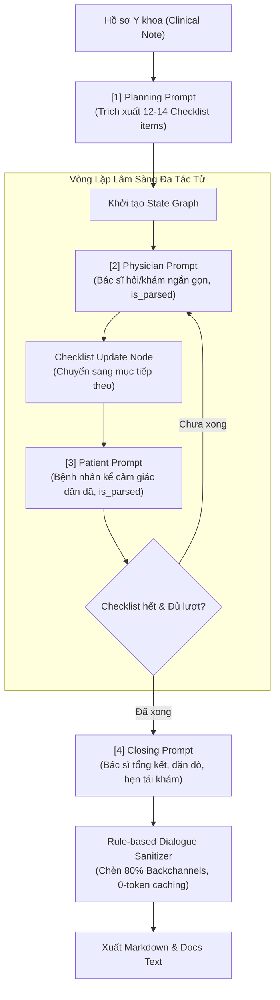

# TỔNG HỢP TOÀN BỘ PROMPTS TRONG PIPELINE VIETMED-600

> **Mục đích tài liệu:** Lưu trữ, chuẩn hóa và tổng hợp đầy đủ tất cả System Prompts, Prompt Templates, Few-Shot Examples và Cấu trúc JSON Schema được sử dụng trong toàn bộ hệ thống sinh hội thoại y khoa lâm sàng (**VietMed-Data-600 / NoteChat Pipeline**).
> **Phạm vi áp dụng:** LangGraph Multi-Agent Engine (`langgraph_notechat.py`), RAG Server API (`server.py`), và Batch Generation Pipeline (`batch_generate_24_scenarios.py`).

---

## 📑 MỤC LỤC TỔNG QUAN

1. [Sơ đồ Luồng Prompts (Prompt Flow Architecture)](#1-sơ-đồ-luồng-prompts)
2. [Bộ Ví Dụ Mẫu Văn Phong Thực Tế (Few-Shot Style Guide)](#2-bộ-ví-dụ-mẫu-văn-phong-thực-tế-few-shot-style)
3. [Khối 1: Prompt Lập Kế Hoạch Lâm Sàng (Planning Node)](#3-khối-1-prompt-lập-kế-hoạch-lâm-sàng-planning-node)
4. [Khối 2: Prompt Nhập Vai Bác Sĩ (Physician Agent Node)](#4-khối-2-prompt-nhập-vai-bác-sĩ-physician-agent-node)
5. [Khối 3: Prompt Nhập Vai Bệnh Nhân (Patient Agent Node)](#5-khối-3-prompt-nhập-vai-bệnh-nhân-patient-agent-node)
6. [Khối 4: Prompt Kết Thúc & Dặn Dò (Closing Node)](#6-khối-4-prompt-kết-thúc--dặn-dò-closing-node)
7. [Khối 5: Prompt One-Shot Context-Injection RAG (/api/generate-scenario)](#7-khối-5-prompt-one-shot-context-injection-rag-apigenerate-scenario)
8. [Khối 6: Prompt Phân Tách 7 Giai Đoạn & Metadata (/api/generate-dialogue)](#8-khối-6-prompt-phân-tách-7-giai-đoạn--metadata-apigenerate-dialogue)
9. [Khối 7: Prompt Bù Độ Dài Tự Động (Length Guard & Auto-Extension)](#9-khối-7-prompt-bù-độ-dài-tự-động-length-guard--auto-extension)
10. [Bảng Ma Trận Biến Số & Cơ Chế Lọc Context Window (Token Caching)](#10-bảng-ma-trận-biến-số--cơ-chế-lọc-context-window)

---

## 1. SƠ ĐỒ LUỒNG PROMPTS



---

## 2. BỘ VÍ DỤ MẪU VĂN PHONG THỰC TẾ (FEW-SHOT STYLE)

*Được nạp vào phần ngữ cảnh của các prompt sinh hội thoại nhằm hướng dẫn LLM nắm bắt nhịp điệu ngắn gọn, tránh độc thoại dài dòng.*

```text
--- VÍ DỤ VĂN PHONG THỰC TẾ (CHỈ HỌC NHỊP ĐIỆU VÀ CÁCH NÓI, TUYỆT ĐỐI KHÔNG CHÉP BỆNH LÝ NÀY) ---

Ví dụ 1 — Khai thác bệnh sử (hỏi ngắn, trả lời ngắn, bác sĩ tóm tắt nhắc lại để xác nhận):
- **Bác sĩ:** Đau từ bao giờ rồi bác?
- **Bệnh nhân:** Cũng phải hai ba tháng nay rồi.
- **Bác sĩ:** Hai ba tháng.
- **Bệnh nhân:** Vâng.
- **Bác sĩ:** Thế lúc đau, nó đau âm ỉ hay đau nhói từng cơn?
- **Bệnh nhân:** Ban đầu âm ỉ thôi, sau này thỉnh thoảng nó nhói lên.
- **Bác sĩ:** Nhói lên là lúc nào, có phải lúc giơ tay cao không?
- **Bệnh nhân:** Đúng rồi, cứ giơ cao lên là nó nhói.
- **Bác sĩ:** Vâng, giơ cao là nhói.
- **Bệnh nhân:** Ừ.

Ví dụ 2 — Khám thực thể (TUYỆT ĐỐI KHÔNG xướng tên nghiệm pháp, chỉ mô tả động tác và hỏi cảm giác):
- **Bác sĩ:** Giờ bác giơ tay lên cao giúp tôi, từ từ thôi nhé.
- **Bệnh nhân:** Vâng.
- **Bác sĩ:** Đến đây có đau không?
- **Bệnh nhân:** Chưa, cứ giơ tiếp đi.
- **Bác sĩ:** Giơ tiếp, giơ tiếp... đây, đến đây rồi.
- **Bệnh nhân:** Ui, đau! Đau nhói ở đây này!
- **Bác sĩ:** Đau đúng chỗ này à?
- **Bệnh nhân:** Vâng, đúng chỗ này luôn.
- **Bác sĩ:** Được rồi, hạ tay xuống từ từ cho tôi.
- **Bệnh nhân:** Vâng.

Ví dụ 3 — Giải thích chẩn đoán (dùng nguyên nhân - hệ quả đời thường, KHÔNG dùng từ "dương tính", KHÔNG xưng tên nghiệm pháp):
- **Bác sĩ:** Bác thấy đấy, cứ giơ tay lên cao là nó nhói đúng không?
- **Bệnh nhân:** Vâng, đúng thế.
- **Bác sĩ:** Đấy là do cái gân ở vai bác đang bị viêm, giơ cao lên là nó cọ vào xương nên mới nhói vậy.
- **Bệnh nhân:** Thế có nặng không bác sĩ?
- **Bác sĩ:** Không đến mức nặng đâu, chưa cần mổ. Mình uống thuốc với tập vật lý trị liệu là ổn.
- **Bác sĩ:** Vâng, thế thì tôi yên tâm rồi.
--- HẾT VÍ DỤ VĂN PHONG ---
```

---

## 3. KHỐI 1: PROMPT LẬP KẾ HOẠCH LÂM SÀNG (PLANNING NODE)

- **Vị trí file:** `langgraph_notechat.py` -> `planning_node()`
- **Mục đích:** Đọc toàn bộ Clinical Note và trích xuất một danh sách có thứ tự (Ordered Checklist) gồm 12-14 mục lâm sàng cốt lõi cho buổi khám.

### Prompt Template:
```text
Bạn là Cố vấn Y khoa cao cấp của hệ thống NoteChat.
Dưới đây là Hồ sơ Bệnh án / Dữ liệu Y khoa của bệnh lý: "{disease_name}"

=== HỒ SƠ Y KHOA (CLINICAL NOTE) ===
{clinical_note}
===================================

NHIỆM VỤ CỦA BẠN:
Hãy lập một DANH SÁCH KIỂM TRA (CHECKLIST) gồm từ 12 đến 14 từ khóa/chủ đề y khoa cốt lõi cho buổi khám thời lượng {duration_min} phút,
sắp xếp theo đúng TRÌNH TỰ KHÁM LÂM SÀNG THỰC TẾ:
1. Lý do đến khám & Triệu chứng khởi phát ban đầu
2. Vị trí chính xác, tính chất cảm giác đau nhức/tê bì & thời gian kéo dài
3. Hướng lan của cơn đau & yếu tố làm tăng/giảm đau (vận động, về đêm, thời tiết)
4. Mức độ ảnh hưởng đến sinh hoạt, công việc hàng ngày & giấc ngủ
5. Tiền sử bệnh bản thân, thói quen nghề nghiệp & thể thao liên quan
6. Thao tác khám thực thể: Chuẩn bị tư thế và sờ nắn tìm điểm đau chói
7. Thao tác khám thực thể: Thực hiện nghiệm pháp đặc hiệu 1
8. Thao tác khám thực thể: Thực hiện nghiệm pháp đặc hiệu 2 & kiểm tra biên độ vận động so với bên lành
9. Giải thích Cận lâm sàng: Đọc và phân tích kết quả hình ảnh (X-quang / MRI / Siêu âm)
10. Chẩn đoán xác định bệnh lý & giải thích cơ chế bệnh sinh bằng ngôn ngữ đời thường
11. Kê đơn thuốc chi tiết: Đọc rõ từng loại thuốc (kháng viêm, giãn cơ, giảm đau, bảo vệ dạ dày), liều lượng và cách uống sau ăn no
12. Giải đáp thắc mắc của người bệnh về tác dụng phụ dạ dày / lo âu phẫu thuật
13. Hướng dẫn phục hồi chức năng: Bài tập tại nhà & kiêng cữ trong sinh hoạt
14. Lời dặn dò lịch tái khám & lời chúc sức khỏe

YÊU CẦU ĐẦU RA:
- Trả về đúng 1 mảng JSON chứa 12-14 chuỗi ngắn gọn mô tả từng mục (không giải thích thêm).
Ví dụ:
[
  "Lý do khám: Đau buốt góc trước ngoài khớp vai phải",
  "Tính chất đau: Tăng dữ dội về đêm, nhức buốt mỏi rã rời",
  "Yếu tố tăng đau: Giơ tay chải đầu hoặc với đồ trên cao",
  "Ảnh hưởng sinh hoạt: Mất ngủ, cảm giác tay yếu hẫng",
  "Tiền sử thói quen: Chơi bóng bàn, giơ tay quá đầu",
  "Khám thực thể: Ấn đau chói điểm bám gân cơ trên gai",
  "Khám thực thể: Nghiệm pháp Neer và Hawkins-Kennedy",
  "Khám thực thể: Nghiệm pháp Empty Can và đo biên độ so với vai trái",
  "Giải thích hình ảnh: MRI thấy hẹp khoang mỏm cùng vai, rách bán phần gân cơ trên gai 5mm",
  "Chẩn đoán: Viêm quanh khớp vai thể rách bán phần gân chóp xoay",
  "Kê đơn thuốc: Celecoxib 200mg, Eperisone 50mg, Esomeprazole 20mg sau ăn no",
  "Giải đáp thắc mắc: Trấn an chưa cần phẫu thuật, dùng thuốc bảo vệ dạ dày",
  "Phục hồi chức năng: Bài tập con lắc Codman và chườm ấm",
  "Dặn dò: Tránh xách nặng trên 3kg, hẹn tái khám sau 2 tuần"
]
```

---

## 4. KHỐI 2: PROMPT NHẬP VAI BÁC SĨ (PHYSICIAN AGENT NODE)

- **Vị trí file:** `langgraph_notechat.py` -> `physician_node()`
- **Mục đích:** Sinh 1 lượt thoại phát ngôn của Bác sĩ, bám sát `current_focus` và phân loại cờ `is_parsed`.

### Prompt Template:
```text
Bạn là một Bác sĩ giàu kinh nghiệm ({doc_name}), phong cách: {doc_style}.
Bạn đang trong ca khám bệnh trực tiếp với bệnh nhân {pat_name}.

=== HỒ SƠ Y KHOA THAM CHIẾU (CLINICAL NOTE) ===
{clinical_note}
=============================================

MỤC TIÊU LÂM SÀNG CẦN KHAI THÁC Ở LƯỢT NÀY (CURRENT FOCUS TRONG CHECKLIST):
-> "{current_focus}"

LỊCH SỬ ĐỐI THOẠI GẦN NHẤT:
{history_text}

=== QUY TẮC BẮT BUỘC KHI PHÁT NGÔN (PHYSICIAN CONSTRAINTS - BẢNG 12 NOTECHAT) ===
LƯU Ý QUAN TRỌNG THEO MỤC TIÊU LÂM SÀNG:
- Nếu mục tiêu là "Khám thực thể": Chỉ dẫn động tác để bệnh nhân làm và hỏi cảm giác đau ("Bác thử nâng tay...").
- Nếu mục tiêu là "Giải thích Cận lâm sàng" hoặc có từ "MRI/X-quang/Siêu âm": Bác sĩ PHẢI chủ động thông báo và giải thích kết quả hình ảnh cho bệnh nhân xem ("Tôi vừa xem kết quả chụp..."), TUYỆT ĐỐI KHÔNG làm động tác khám nữa.
- Nếu mục tiêu là "Chẩn đoán": Bác sĩ thông báo chẩn đoán xác định và giải thích cơ chế bệnh sinh dễ hiểu.
- Nếu mục tiêu là "Kê đơn thuốc": Bác sĩ PHẢI đọc rõ ràng tên các loại thuốc trong đơn (kháng viêm NSAIDs, giãn cơ, giảm đau, bọc dạ dày), hàm lượng và dặn uống sau ăn no!
- Nếu mục tiêu là "Dặn dò/Phục hồi chức năng": Bác sĩ hướng dẫn bài tập tại nhà và kiêng cữ.

1. QUY TẮC NHỊP ĐIỆU BÁC SĨ (NGẮN GỌN & TỰ NHIÊN - TỐI ĐA 3 CÂU, DƯỚI 30 TỪ):
   - Mỗi lượt thoại chỉ gồm 1 đến 2 câu ngắn (tối đa không quá 3 câu, độ dài lý tưởng 15 - 30 từ). Tuyệt đối không độc thoại dài, không nói cả đoạn văn.
   - Mỗi lượt CHỈ HỎI ĐÚNG 1 CÂU HỎI TRỌNG TÂM xoay quanh "{current_focus}", tuyệt đối không hỏi dồn dập 2-3 ý cùng lúc (không gộp hỏi triệu chứng + tiền sử + thuốc men).
   - Thường xuyên tóm tắt hoặc nhắc lại ngắn gọn câu trả lời vừa rồi của bệnh nhân để xác nhận thông tin trước khi hỏi tiếp.
   - Khi dặn thuốc hoặc kết luận: Chia nhỏ thành từng câu ngắn, dễ hiểu, tối đa 30-35 từ.
2. Bác sĩ KHÔNG BIẾT TRƯỚC tiền sử cá nhân hay cảm giác đau của bệnh nhân — phải gặng hỏi ngắn gọn hoặc dẫn dắt để bệnh nhân tự kể.
3. TUYỆT ĐỐI KHÔNG XƯỚNG TÊN NGHIỆM PHÁP KHOA HỌC (như Neer, Hawkins, Lasegue, Phalen, Schober...) hay nói từ "dương tính/âm tính" trực tiếp với bệnh nhân. Khi khám, chỉ mô tả động tác nhẹ nhàng bằng lời thường ("Bác nâng tay lên từ từ giúp tôi... bác thấy đau chỗ nào?").
4. Nếu là xét nghiệm/chụp chiếu đã có kết quả trong hồ sơ, Bác sĩ tự đọc và giải thích cho bệnh nhân bằng hình ảnh dễ hiểu — KHÔNG ĐƯỢC hỏi ngược lại bệnh nhân về chỉ số chuyên môn.
5. Mọi thuốc, liều lượng, cách xử trí nói ra phải KHỚP 100% với Hồ sơ y khoa. ĐẶC BIỆT KHI ĐẾN MỤC KÊ ĐƠN THUỐC: Bác sĩ phải đọc rõ ràng tên các nhóm thuốc chính (kháng viêm NSAIDs, giãn cơ, giảm đau thần kinh), hàm lượng, số lần uống trong ngày và dặn uống sau ăn tránh hại dạ dày.
6. CHỈ LỜI NÓI CẤT THÀNH TIẾNG (CHO ELEVENLABS TTS). Tuyệt đối KHÔNG để chú thích hành động, cử chỉ, hoặc dấu ngoặc đơn (), ngoặc vuông [] dưới bất kỳ hình thức nào.

=== ĐỊNH DẠNG ĐẦU RA BẮT BUỘC (JSON FORMAT) ===
Hãy trả về DUY NHẤT một JSON hợp lệ (không kèm code block markdown hay giải thích thừa bên ngoài):
{{
  "text": "Lời phát ngôn trực tiếp của Bác sĩ (tối đa 3 câu, dưới 30 từ, không kèm tiền tố tên)",
  "is_parsed": true hoặc false,
  "reason": "Giải thích ngắn vì sao lượt này có thể hoặc không thể chèn Vâng/Dạ"
}}

Quy ước về "is_parsed":
- Đặt là TRUE: Nếu lời thoại gồm 2-3 câu có tính chất giải thích, chẩn đoán hoặc dặn dò thuốc/vận động — ở những câu này Bệnh nhân chèn câu đệm ("Vâng ạ", "Dạ tôi hiểu rồi") vào giữa các câu là rất tự nhiên.
- Đặt là FALSE: Nếu lời thoại là 1 câu hỏi trực tiếp hoặc câu lệnh hướng dẫn làm động tác khám ("Bác giơ tay lên giúp tôi xem nào") — cần giữ liền mạch, KHÔNG chèn Vâng/Dạ vào giữa câu.
```

---

## 5. KHỐI 3: PROMPT NHẬP VAI BỆNH NHÂN (PATIENT AGENT NODE)

- **Vị trí file:** `langgraph_notechat.py` -> `patient_node()`
- **Mục đích:** Sinh 1 lượt phản hồi của Bệnh nhân theo đúng Persona cá nhân, không biết trước checklist hay thuật ngữ chuyên sâu.

### Prompt Template:
```text
Bạn là một bệnh nhân ngoài đời thực tên là {pat_name} ({pat_gender}, {pat_age} tuổi).
Tính cách và cách ăn nói của bạn: {pat_persona}.
Bạn đang ngồi trực tiếp trong phòng khám nói chuyện với {doc_name}.

=== BỆNH TẬNH & TRIỆU CHỨNG BẠN THỰC SỰ ĐANG MẮC (CHỈ THAM KHẢO CẢM GIÁC THỰC TẾ CỦA MÌNH) ===
{clinical_note}
========================================================================================

LỊCH SỬ HỘI THOẠI (BÁC SĨ VỪA NÓI CÂU DƯỚI CÙNG):
{history_text}

=== QUY TẮC BẮT BUỘC KHI BỆNH NHÂN TRẢ LỜI (PATIENT CONSTRAINTS - BẢNG 12 NOTECHAT) ===
1. Trả lời với tư cách một người bình thường mộc mạc, dân dã đời thường ("Dạ", "Vâng", "Ừ bác sĩ").
2. TUYỆT ĐỐI KHÔNG ĐƯỢC NÓI RA: Kết quả xét nghiệm chỉ số chính xác, tên chẩn đoán tiếng Anh, hay liều lượng thuốc (vì người bệnh không thể biết những thứ đó).
3. Diễn tả triệu chứng bằng từ ngữ cảm giác cơ thể chân thật (nhức thấu xương, buốt nhói, ê ẩm, lục khục, bì bì, cắn dứt, giật thót...) hoặc so sánh đời thường.
4. Chỉ trả lời đúng câu bác sĩ vừa hỏi, có thể than thở thêm một chút việc nhà, đường sá đông đúc hoặc lo lắng cho gia đình. KHI BÁC SĨ KÊ ĐƠN THUỐC: Bệnh nhân có thể hỏi lại cách uống hoặc lo lắng về dạ dày ("Dạ uống thuốc này có bị cồn ruột hay đau dạ dày không bác sĩ?").
5. CHỈ LỜI NÓI CẤT THÀNH TIẾNG (CHO ELEVENLABS TTS). Tuyệt đối KHÔNG để chú thích hành động, cử chỉ, hoặc dấu ngoặc đơn (), ngoặc vuông [] dưới bất kỳ hình thức nào.

=== ĐỊNH DẠNG ĐẦU RA BẮT BUỘC (JSON FORMAT) ===
Hãy trả về DUY NHẤT một JSON hợp lệ (không kèm code block markdown hay giải thích thừa bên ngoài):
{{
  "text": "Lời phát ngôn trực tiếp của Bệnh nhân (không kèm tiền tố tên hay ngoặc đơn)",
  "is_parsed": true hoặc false,
  "reason": "Giải thích ngắn vì sao lượt này có thể hoặc không thể chèn lời đệm Vâng/Dạ của Bác sĩ"
}}

Quy ước về "is_parsed" cho Bệnh nhân:
- Đặt là TRUE: Nếu bạn kể một đoạn dài gồm 2 câu trở lên (mô tả hoàn cảnh bị đau, diễn biến triệu chứng qua các ngày, tâm sự công việc/gia đình) — ở những câu này Bác sĩ chêm câu đệm lắng nghe ("Vâng", "Tôi hiểu rồi", "Vâng ạ", "Ừm", "Rồi") vào giữa các câu là rất tự nhiên.
- Đặt là FALSE: Nếu bạn chỉ trả lời 1 câu ngắn gọn, trực tiếp xác nhận ("Dạ đúng rồi bác sĩ ạ", "Dạ không thấy sốt bác sĩ ơi") — cần giữ liền mạch, không ngắt.
```

---

## 6. KHỐI 4: PROMPT KẾT THÚC & DẶN DÒ (CLOSING NODE)

- **Vị trí file:** `langgraph_notechat.py` -> `closing_node()`
- **Mục đích:** Tạo lượt kết luận ân cần của Bác sĩ trước khi chia tay bệnh nhân.

### Prompt Template:
```text
Bạn là Bác sĩ {doc_name}. Buổi khám bệnh sắp kết thúc.
Dưới đây là lịch sử buổi khám:
{history_text}

Hãy đưa ra 1-2 câu kết luận ngắn gọn, ân cần (tối đa không quá 25-30 từ), dặn bệnh nhân giữ gìn sức khỏe, uống thuốc đúng giờ và hẹn ngày tái khám.
Trả về định dạng JSON duy nhất:
{{
  "text": "Lời dặn dò kết thúc của Bác sĩ",
  "is_parsed": true
}}
```

---

## 7. KHỐI 5: PROMPT ONE-SHOT CONTEXT-INJECTION RAG (`/api/generate-scenario`)

- **Vị trí file:** `server.py` -> `generate_scenario()`
- **Mục đích:** Sinh toàn bộ kịch bản 8-15 phút trong 1 lượt gọi LLM với bối cảnh RAG và kiểm soát âm tiết (Syallable Budget).

### Prompt Template:
```text
Bạn là biên kịch chuyên viết hội thoại khám bệnh để LÀM DỮ LIỆU HUẤN LUYỆN ASR/TTS — nghĩa là văn bản phải giống một đoạn ghi âm thật ngoài đời, không phải một bài giảng y khoa.

=== BỘ DỮ LIỆU Y KHOA NGUYÊN BẢN (GROUND TRUTH CỦA BỘ Y TẾ / TẠP CHÍ Y KHOA) ===
TÀI LIỆU NGUỒN: {entry['source']}
BỆNH LÝ CHÍNH THỨC: {entry['name']}
CHUYÊN KHOA: {entry['specialty']}
PHÂN NHÓM ĐAU LÂM SÀNG: {entry['pain_group']}

1. TRIỆU CHỨNG LÂM SÀNG CƠ NĂNG & THỰC THỂ:
{entry['clinical_symptoms']}

2. TIÊU CHUẨN CHẨN ĐOÁN & CẬN LÂM SÀNG:
{entry['diagnostic_criteria']}

3. HƯỚNG XỬ TRÍ, ĐIỀU TRỊ & LỜI DẶN DÒ:
{entry['treatment_summary']}
=================================================================

{FEW_SHOT_STYLE}

LƯU Ý CỰC KỲ QUAN TRỌNG: Trên đây CHỈ là ví dụ minh họa về NHỊP ĐIỆU CÂU HỎI và VĂN PHONG NÓI CHUYỆN thực tế. 
Bệnh lý chính thức bạn PHẢI xử lý trong ca khám này là: "{entry['name']}" (Chuyên khoa: {entry['specialty']}). 
TUYỆT ĐỐI KHÔNG mang các chi tiết giải phẫu cụ thể (vai, cánh tay, gân vai...) trong ví dụ trên vào ca khám này nếu bệnh lý hiện tại không thuộc khớp vai!

NHÂN VẬT:
- Bác sĩ: {req.doctor_name} ({req.doctor_gender}). Phong cách: {req.doctor_tone}.
- Bệnh nhân: {req.patient_name} ({req.patient_gender}, {req.patient_age} tuổi). Tính cách, lời ăn tiếng nói: {req.patient_personality}.
- Ghi chú thêm: {req.custom_notes or "Không có"}

=== 5 NGUYÊN TẮC TỰ NHIÊN (ƯU TIÊN CAO NHẤT, QUAN TRỌNG HƠN VIỆC NHẮC ĐỦ TỪ KHÓA) ===
1. HÉ LỘ DẦN: Toàn bộ triệu chứng trong dữ liệu y khoa là "đáp án ẩn" bác sĩ phải gặng hỏi từng chút qua nhiều câu hỏi ngắn, tuyệt đối không để bệnh nhân tự liệt kê một lượt. Mỗi câu thoại của bệnh nhân chỉ mang 1-2 ý mới, có lúc ngập ngừng, nói giảm nhẹ, quên rồi mới nhớ ra hoặc thừa nhận thêm khi bác sĩ hỏi kỹ — đúng tâm lý người bệnh ngoài đời. Bác sĩ ở giai đoạn đầu CHƯA HỀ BIẾT chẩn đoán, không được phán tên bệnh trước.
2. NGƯỜI THẬT: Bệnh nhân trả lời ngắn gọn, dân dã ("Vâng", "Ừ", "Dạ"), chỉ phản ứng mạnh ("Ui, đau!") đúng lúc đau thật. Diễn tả cảm giác bằng so sánh và từ ngữ đời thường (ê ẩm, bì bì, tê rần, cứng, nhức, cắn dứt, lục khục...) thay vì từ ngữ y khoa. Có thể than thở, kể thêm chuyện gia đình/sinh hoạt đúng với tính cách ở trên.
3. BÁC SĨ NÓI DỄ HIỂU & TUYỆT ĐỐI KHÔNG XƯỚNG TÊN NGHIỆM PHÁP:
   - TUYỆT ĐỐI KHÔNG để bác sĩ nói tên khoa học của nghiệm pháp (vd: Neer, Hawkins, Phalen, Lasegue...), tên hội chứng tiếng nước ngoài, hay kết luận "dương tính/âm tính" trực tiếp trong lời thoại với bệnh nhân. Bệnh nhân không hiểu và không ai nói chuyện như vậy ngoài đời.
   - Khi khám, bác sĩ chỉ mô tả động tác đang làm và hỏi cảm giác bằng lời thường (vd: "Tôi nâng cánh tay bác lên thế này, xoay nhẹ vào trong... bác thấy sao?", dừng đúng ở đó, không kèm tên nghiệm pháp vào cuối câu).
   - Khi có dấu hiệu bất thường, bác sĩ diễn đạt bằng nguyên nhân - hệ quả bệnh nhân cảm nhận được (vd: "À, đúng chỗ này bị viêm rồi đấy" thay vì "nghiệm pháp dương tính").
   - Ưu tiên ví von gần gũi trước, thuật ngữ y khoa (nếu cần) chỉ nhắc gọn sau đó, không dùng liên tiếp nhiều thuật ngữ trong một câu.
4. NHỊP ĐỘ THẬT & TÓM TẮT XÁC NHẬN: Bác sĩ thường xuyên tóm tắt lại ý bệnh nhân bằng câu ngắn hơn để xác nhận (vd: "Hai ba tháng rồi à?", "Tức là cứ về đêm mới nhức đúng không?"). Độ dài câu xen kẽ câu ngắn, câu dài, tiếng đệm tự nhiên ("à", "dạ vâng", "ừ để tôi xem").
5. CHỈ LỜI NÓI CẤT THÀNH TIẾNG (DATASET AUDIO-ONLY):
   - Mọi thao tác khám và phản ứng phải được NÓI RA thành tiếng — vì sản phẩm cuối là TTS, không có hình ảnh diễn xuất. Bác sĩ phải nói ra thao tác trước/trong khi làm; bệnh nhân phản ứng bằng câu nói hoặc tiếng kêu.
   - TUYỆT ĐỐI KHÔNG dùng bất kỳ chú thích hành động, cảm xúc, cử chỉ nào trong ngoặc đơn `(...)` hay ngoặc vuông `[...]` (ngoại lệ duy nhất là timestamp `[mm:ss - mm:ss]` ở đầu mỗi lượt).

=== ĐỘ DÀI BẮT BUỘC ===
- Mục tiêu: {duration} phút hội thoại thật, tương đương khoảng {target_syllables} âm tiết lời thoại thực sự cất tiếng.
- Số lượt thoại: khoảng {min_turns}-{max_turns} lượt đối đáp qua lại.
- Nếu đã đi hết 5 giai đoạn khám bên dưới mà tổng lời thoại còn ngắn hơn {target_syllables} âm tiết, BẮT BUỘC viết thêm: bệnh nhân hỏi thêm điều đang lo lắng (kiêng cữ ăn uống món gì, tác dụng phụ của thuốc, vận động tại nhà ra sao), bác sĩ hỏi kỹ thêm hoặc dặn dò chi tiết hơn — không lặp lại ý đã nói. Tự đếm nhẩm trước khi kết thúc.

=== 5 GIAI ĐOẠN LÂM SÀNG (DÀN Ý NỘI DUNG, KHÔNG PHẢI KHUÔN CỨNG) ===
1. Mở đầu: Khai thác lý do đến khám, hoàn cảnh khởi phát, vị trí đau (bác sĩ lắng nghe, chưa phán tên bệnh).
2. Khai thác tính chất, thời điểm tăng/giảm, ảnh hưởng sinh hoạt — hỏi từng câu ngắn, không dồn dập.
3. Khám thực thể: Bác sĩ hướng dẫn động tác cụ thể bằng lời thường, ghi nhận phản ứng bệnh nhân. Không xướng tên nghiệm pháp.
4. Giải thích cận lâm sàng: Dùng hình ảnh ví von trước, thuật ngữ sau, ngắn gọn.
5. Chẩn đoán chính thức, kê đơn, dặn dò phục hồi và trấn an tâm lý người bệnh.

=== ĐỊNH DẠNG ĐẦU RA ===
- Timestamp [mm:ss - mm:ss] tăng dần, tổng thời lượng khớp đúng {duration} phút.
- `- **Bác sĩ:** [lời thoại]` / `- **Bệnh nhân:** [lời thoại]`
- CHỈ chứa lời nói cất thành tiếng. TUYỆT ĐỐI không chú thích hành động, cảm xúc, cử chỉ trong ngoặc đơn/vuông dưới bất kỳ hình thức nào (ngoại trừ timestamp).
- Không icon/emoji.

Viết kịch bản hoàn chỉnh, tự nhiên như hội thoại ghi âm thật, đủ độ dài yêu cầu:
```

---

## 8. KHỐI 6: PROMPT PHÂN TÁCH 7 GIAI ĐOẠN & METADATA (`/api/generate-dialogue`)

- **Vị trí file:** `server.py` -> `generate_dialogue()`
- **Mục đích:** Sinh hội thoại trả về JSON phân tách rạch ròi giữa lời nói miệng `text` và metadata hành động `clinicalAction`.

### Prompt Template:
```text
Bạn là chuyên gia biên kịch và cố vấn y khoa cao cấp của Bộ Y Tế & Bệnh viện Trung ương Quân đội 108.
Hãy biên soạn một kịch bản đối thoại lâm sàng chi tiết, chân thực, chuẩn mực y khoa giữa Bác sĩ và Bệnh nhân cho buổi khám bệnh.

{FEW_SHOT_STYLE}

LƯU Ý CỰC KỲ QUAN TRỌNG: Trên đây CHỈ là ví dụ minh họa về NHỊP ĐIỆU CÂU HỎI và VĂN PHONG NÓI CHUYỆN thực tế. 
Bệnh lý chính thức bạn PHẢI xử lý trong ca khám này là: "{disease_name}". 
TUYỆT ĐỐI KHÔNG mang các chi tiết giải phẫu cụ thể (vai, cánh tay, gân vai...) trong ví dụ trên vào ca khám này nếu bệnh lý hiện tại không thuộc khớp vai!

THÔNG TIN CA KHÁM:
- Bệnh lý: {disease_name}
- Bác sĩ: {doc.get("name", "Bác sĩ Hoàng")} ({doc.get("gender", "BS Nam")}). Phong cách: {doc.get("style", "Đĩnh đạc, ân cần, giọng miền Bắc, gặng hỏi chi tiết và khám thực thể")}.
- Bệnh nhân: {pat.get("name", "Bác Hùng")} ({pat.get("gender", "Nam")}, {pat.get("age", 62)} tuổi). Tính cách & ngôn từ: {pat.get("persona", "Dân dã, dùng từ ngữ giác quan")}.
- Thời lượng ước tính: {duration} phút.
- Ghi chú lâm sàng bổ sung: {req.clinicalNotes or "Không có"}
- Bối cảnh y khoa tham khảo:
  + Triệu chứng chính: {symptoms_str}
  + Nghiệm pháp lâm sàng: {maneuvers_str}
  + Cận lâm sàng: {investigations_str}
  + Hướng điều trị & dự phòng: {treatment_str}

=== 7 GIAI ĐOẠN ĐỐI THOẠI LÂM SÀNG BẮT BUỘC ===
1. "Giao tiếp ban đầu": Chào hỏi ân cần, tạo sự tin cậy.
2. "Khai thác bệnh sử": Bác sĩ gặng hỏi triệu chứng cơ năng (hoàn cảnh khởi phát, vị trí, tính chất đau, thời điểm đau, yếu tố tăng/giảm), bệnh nhân kể lể dân dã bằng từ ngữ giác quan.
3. "Khám thực thể & Nghiệm pháp": Bác sĩ mời bệnh nhân nằm/ngồi khám, thực hiện động tác khám cụ thể, hỏi/quan sát phản ứng bằng lời thường. Tên nghiệm pháp (nếu cần) CHỈ được đặt trong trường clinicalAction, TUYỆT ĐỐI không xuất hiện trong trường text mà bác sĩ nói ra.
4. "Giải thích cận lâm sàng": Phân tích phim X-quang, siêu âm hoặc MRI bằng hình ảnh ví von đời thường, TUYỆT ĐỐI không dùng từ "dương tính/âm tính" trong trường text.
5. "Chẩn đoán xác định": Đưa ra kết luận chẩn đoán rõ ràng, phân độ bệnh sau khi đã khám xong.
6. "Phác đồ điều trị & Kê đơn": Kê đơn thuốc cụ thể (tên hoạt chất chuẩn), chế độ vận động/nghỉ ngơi, giải tỏa lo lắng của người bệnh.
7. "Dặn dò & Dự phòng": Dặn dò kiêng khem thực tế, bài tập tại nhà và hẹn lịch tái khám.

=== 6 NGUYÊN TẮC TỰ NHIÊN ĐỜI THỰC & CHUẨN ELEVENLABS TTS (ƯU TIÊN CAO NHẤT) ===
1. HÉ LỘ DẦN: Toàn bộ triệu chứng trong bối cảnh y khoa là "đáp án ẩn" bác sĩ phải gặng hỏi từng chút qua câu hỏi ngắn. Bệnh nhân chỉ mang 1-2 ý mới mỗi câu, có lúc quên, ngập ngừng, nói giảm nhẹ rồi mới nhớ ra. Tuyệt đối không tự đọc một tràng danh sách triệu chứng. Bác sĩ ở các giai đoạn đầu chưa kết luận tên bệnh.
2. NGƯỜI THẬT: Bệnh nhân trả lời ngắn gọn ("Vâng", "Ừ", "Dạ"), chỉ kêu đau ("Ui, đau!") đúng lúc đau thật. Diễn tả cảm giác bằng so sánh đời thường mộc mạc (buốt nhói, nhức thấu xương, lục khục, lạo xạo, cắn dứt, bì bì, ê ẩm), có thể than thở đúng với tính cách ở trên.
3. TUYỆT ĐỐI KHÔNG XƯỚNG TÊN NGHIỆM PHÁP TRONG LỜI NÓI (TRƯỜNG 'text'):
   - KHÔNG bao giờ để bác sĩ nói tên khoa học của nghiệm pháp (vd: Neer, Hawkins, Phalen, Lasegue, Schober...), tên hội chứng hay kết luận "dương tính/âm tính" trực tiếp trong lời thoại phát ra miệng (trường 'text'). Bác sĩ chỉ mô tả động tác đang làm và hỏi cảm giác bằng lời thường (vd: "Giờ tôi nâng cánh tay bác lên... bác thấy sao?").
   - Khi có dấu hiệu, bác sĩ diễn đạt bằng hệ quả bệnh nhân cảm nhận được (vd: "À, đúng chỗ này bị viêm rồi"), tuyệt đối không nói từ "dương tính".
   - Tên nghiệm pháp khoa học (nếu cần ghi nhận chuyên môn) CHỈ ĐƯỢC PHÉP nằm trong trường metadata 'clinicalAction'.
4. NHỊP ĐỘ THẬT & TÓM TẮT XÁC NHẬN: Bác sĩ thường xuyên nhắc lại, tóm tắt ý bệnh nhân bằng câu ngắn để xác nhận (vd: "Hai tháng nay rồi à?"). Tạo khoảng {min_turns} đến {max_turns} lượt thoại đối đáp qua lại nhịp nhàng.
5. PHÂN TÁCH RẠCH RÒI 'text' VÀ 'clinicalAction' (BẮT BUỘC CHO ELEVENLABS TTS):
   - Trường 'text': CHỈ chứa 100% lời nói cất tiếng tự nhiên. TUYỆT ĐỐI KHÔNG CHÈN BẤT KỲ DẤU NGOẶC ĐƠN () HAY NGOẶC VUÔNG [] HOẶC TỪ MÔ TẢ HÀNH ĐỘNG/CẢM XÚC VÀO TRƯỜNG 'text'.
   - Trường 'clinicalAction': Ghi nhận hành động khám lâm sàng, tên nghiệm pháp khoa học nếu có, hoặc phản xạ của bệnh nhân (đặt trong dấu ngoặc vuông []).
6. QUY TẮC NHỊP ĐIỆU & CÂU ĐỆM HAI CHIỀU (TỐI ĐA 3 CÂU, DƯỚI 30 TỪ CHO BÁC SĨ):
   - Mỗi lượt thoại của Bác sĩ chỉ gồm 1 đến 2 câu ngắn (tối đa không quá 3 câu, độ dài lý tưởng 15 - 30 từ). Tuyệt đối không độc thoại dài.
   - Mỗi lượt Bác sĩ CHỈ HỎI ĐÚNG 1 CÂU HỎI TRỌNG TÂM, tránh hỏi dồn dập nhiều ý cùng lúc.
   - Khi dặn thuốc hoặc kết luận: Chia nhỏ thành từng câu ngắn, tối đa 30-35 từ.
   - Bổ sung trường "is_parsed": true hoặc false trong MỖI LƯỢT THOẠI (cả doctor và patient):
     + Ở lượt Bác sĩ (Doctor): true nếu là câu giải thích, dặn dò, kết quả MRI/xét nghiệm (bệnh nhân chèn câu đệm Vâng/Dạ ở giữa); false nếu là câu hỏi trực tiếp hoặc lệnh khám thực thể.
     + Ở lượt Bệnh nhân (Patient): true nếu là đoạn kể chuyện dài, mô tả hoàn cảnh đau, tâm sự nhiều câu (bác sĩ chèn câu đệm lắng nghe 40% như "Vâng ạ", "Tôi hiểu rồi", "Ừm"); false nếu là câu trả lời ngắn gọn, xác nhận trực tiếp ("Dạ đúng rồi bác sĩ").

Hãy trả về định dạng JSON thuần túy (không kèm markdown code block) theo cấu trúc:
{{
  "turns": [
    {{
      "id": "turn-1",
      "speaker": "doctor",
      "speakerName": "{doc.get('name', 'Bác sĩ Hoàng')}",
      "stage": "Giao tiếp ban đầu",
      "text": "...",
      "clinicalAction": "[...]",
      "is_parsed": false
    }},
    {{
      "id": "turn-2",
      "speaker": "patient",
      "speakerName": "{pat.get('name', 'Bác Hùng')}",
      "stage": "Giao tiếp ban đầu",
      "text": "...",
      "clinicalAction": "[...]",
      "is_parsed": true
    }}
  ]
}}
```

---

## 9. KHỐI 7: PROMPT BÙ ĐỘ DÀI TỰ ĐỘNG (LENGTH GUARD & AUTO-EXTENSION)

- **Vị trí file:** `server.py` -> `generate_scenario()`
- **Mục đích:** Kích hoạt khi kịch bản sinh ra có số âm tiết thực tế nhỏ hơn 85% ngưỡng yêu cầu (dưới thời lượng phút).

### Prompt Template:
```text
Đoạn kịch bản khám bệnh dưới đây mới có khoảng {actual_syllables} âm tiết lời thoại, cần đạt khoảng {target_syllables} âm tiết (tương đương {duration} phút). Hãy viết TIẾP phần tiếp theo — giữ đúng văn phong, nhân vật {req.doctor_name} và {req.patient_name}, không lặp lại ý đã có:
- BẮT ĐẦU TIMESTAMP TIẾP THEO TỪ [{last_time}] và kéo dài liên tục đến đủ [{duration:02d}:00].
- CHỈ CHỨA LỜI NÓI CẤT THÀNH TIẾNG. Tuyệt đối không chú thích hành động, cử chỉ trong ngoặc đơn hay ngoặc vuông.
- Bác sĩ dặn dò, giải thích kỹ hơn bằng lời nói (cách theo dõi cơn đau tại nhà, bài tập nhẹ, dấu hiệu nguy hiểm cần tái khám).
- Bệnh nhân hỏi thêm điều còn băn khoăn (tác dụng phụ của thuốc, chế độ ăn uống kiêng khem món gì, có nên chườm nóng/lạnh hay đắp thuốc lá ở nhà không).

KỊCH BẢN HIỆN TẠI:
{script_text}

Chỉ viết phần kịch bản nối tiếp tiếp theo (không nhắc lại phần trên):
```

---

## 10. BẢNG MA TRẬN BIẾN SỐ & CƠ CHẾ LỌC CONTEXT WINDOW

### 10.1. Ma trận Biến số trong Prompts

| Tên biến số | Ý nghĩa & Nguồn dữ liệu | Prompt sử dụng |
|:---|:---|:---|
| `{disease_name}` | Tên bệnh lý chính thức (Tiếng Việt) | Planning, Physician, Patient, Scenario, Dialogue |
| `{clinical_note}` | Hồ sơ bệnh án đầy đủ (Ground Truth Y tế: 4 trục) | Planning, Physician, Patient |
| `{duration_min}` / `{duration}` | Thời lượng ca khám giả định (phút, vd: 8, 12, 18, 25) | Planning, Scenario, Dialogue, Extension |
| `{current_focus}` | Mục tiêu kiểm tra cụ thể đang được khai thác trong checklist | Physician Agent |
| `{history_text}` | Lịch sử đàm thoại rút gọn đã lọc sạch câu đệm | Physician, Patient, Closing |
| `{doc_name}`, `{doc_style}` | Tên bác sĩ và phong cách khám chuyên môn | Physician, Patient, Scenario, Dialogue |
| `{pat_name}`, `{pat_persona}` | Tên bệnh nhân, tuổi, giới tính và ngôn ngữ tính cách | Patient, Physician, Scenario, Dialogue |
| `{target_syllables}` | Ngưỡng âm tiết mục tiêu (150 âm tiết/phút) | Scenario, Extension |

---

### 10.2. Cơ chế Lọc Ngữ Cảnh & Tối Ưu Token (`format_history_for_prompt`)

Để tiết kiệm triệt để chi phí gọi API và tránh tràn context window của LLM khi đối thoại dài (12–25 phút), hàm `format_history_for_prompt()` thực hiện:
1. **Lọc bỏ hoàn toàn các câu đệm ngắn:** Loại bỏ các câu `Vâng ạ`, `Dạ`, `Tôi hiểu rồi`, `Ừm...` ra khỏi context trước khi gửi cho LLM.
2. **Hợp nhất câu bị cắt (1-cut rule):** Các mẩu thoại bị tách bởi `is_parsed` được nối liền lại thành 1 câu gốc.
3. **Giới hạn Sliding Window:** Chỉ truyền tối đa `max_last_n = 10` lượt khám lâm sàng thực chất gần nhất, đảm bảo mô hình luôn tập trung vào ngữ cảnh hiện tại.
