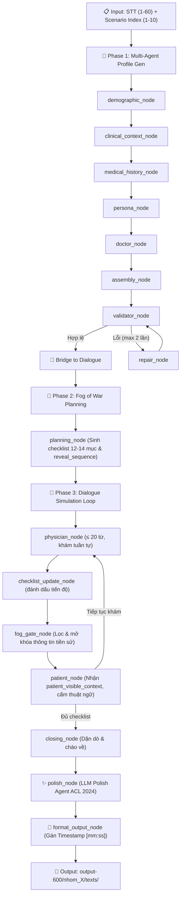

# 🏥 VietMed E2E Pipeline (vietmed_e2e)

Hệ thống hợp nhất toàn diện (End-to-End) kết nối hai pipeline:
1. **Profile Generation Pipeline** (`D:\SPIT_Generation\src\`): Sinh hồ sơ lâm sàng đa tác tử (Bệnh nhân 9 trường + Bác sĩ 6 trường) bám sát Tri thức 60 bệnh chuẩn Bộ Y tế.
2. **Dialogue Simulation Pipeline** (`D:\test STT\langgraph_notechat.py`): Mô phỏng hội thoại khám bệnh lâm sàng (30-56 lượt) tích hợp **Sương mù thông tin (Fog of War)** và **LLM Polish Agent (ACL 2024)**.

---

## 1. Kiến Trúc Tổng Thể



---

## 2. Cơ Chế Fog of War (Sương Mù Thông Tin)

Trong khám bệnh thực tế, **Bác sĩ không biết tiền sử bệnh nhân trước khi hỏi**, và **Bệnh nhân chỉ trả lời khi được hỏi đúng chủ đề**:
- **Khởi đầu buổi khám:** Bệnh nhân chỉ biết lý do đến khám (`chief_complaint`), thời gian bắt đầu bị (`onset_duration`) và nghề nghiệp. Bệnh nhân hoàn toàn **KHÔNG BIẾT** kết quả chụp MRI/X-quang, chẩn đoán hay tên thuốc mới.
- **Bác sĩ hỏi tiền sử bệnh nền:** `fog_gate_node` mở khóa trường `chronic_conditions`.
- **Bác sĩ hỏi thói quen sinh hoạt:** Mở khóa trường `lifestyle_risk_factors`.
- **Bác sĩ hỏi cách tự chữa ở nhà:** Mở khóa trường `prior_pain_treatments`.
- **Bác sĩ hỏi chấn thương/mổ cũ:** Mở khóa trường `past_surgeries_trauma`.
- **Bác sĩ kê đơn thuốc:** Mở khóa trường `current_medications` và `allergies_intolerances`.

---

## 3. Cấu Trúc Thư Mục `vietmed_e2e`

```
D:\test STT\vietmed_e2e\
├── __init__.py                  # Package exports
├── config.py                    # Cấu hình tập trung (.env, models, paths)
├── run_e2e.py                   # CLI Entry Point
├── pipeline.py                  # LangGraph StateGraph kết nối toàn bộ
├── README.md                    # Tài liệu hướng dẫn chi tiết
│
├── schemas/
│   ├── __init__.py
│   ├── patient.py               # PatientProfile (9 trường chuẩn + 6 subfields)
│   ├── doctor.py                # DoctorProfile (6 trường chuẩn)
│   ├── fog.py                   # RevealItem, FogState
│   └── state.py                 # E2EState (Merged State)
│
├── agents/                      # Sub-Agents sinh Profile
│   ├── __init__.py
│   ├── llm_client.py            # Unified OpenRouter + Gemini caller
│   ├── demographic_agent.py
│   ├── clinical_context_agent.py
│   ├── medical_history_agent.py
│   ├── persona_edge_case_agent.py
│   ├── doctor_agent.py
│   └── repair_agent.py
│
├── dialogue/                    # Nodes mô phỏng hội thoại lâm sàng
│   ├── __init__.py
│   ├── planning_node.py         # Trích xuất checklist & reveal_sequence
│   ├── fog_gate_node.py         # Lọc context theo sương mù thông tin
│   ├── physician_node.py        # Physician-LLM (≤ 20 từ)
│   ├── patient_node.py          # Patient-LLM (dân dã, cấm từ giải phẫu)
│   ├── checklist_update_node.py # Cập nhật checklist & condition check
│   ├── closing_node.py          # Bác sĩ dặn dò, bệnh nhân chào về
│   ├── polish_node.py           # LLM Polish Agent (ACL 2024)
│   ├── format_output_node.py    # Gán Timestamp [mm:ss]
│   └── utils.py                 # Định dạng lịch sử & đếm từ
│
├── knowledge/
│   ├── __init__.py
│   └── kb_loader.py             # Bộ nạp 60 bệnh từ Markdown & JSON
│
├── validators/
│   ├── __init__.py
│   └── consistency_validator.py # Bộ kiểm định tính nhất quán hồ sơ
│
└── sanitizer/
    ├── __init__.py
    └── dialogue_sanitizer.py    # Làm sạch text, cấm tên nghiệm pháp, tính timestamp
```

---

## 4. Hướng Dẫn Sử Dụng

### 4.1 Chạy qua dòng lệnh (CLI)

```bash
# Chạy Bệnh 01 (Viêm quanh khớp vai), kịch bản 01, thời lượng 12 phút
python -m vietmed_e2e.run_e2e --stt 1 --kb 1 --duration 12 --target_turns 28

# Chạy Bệnh 15, kịch bản 02, thời lượng 8 phút
python -m vietmed_e2e.run_e2e --stt 15 --kb 2 --duration 8 --target_turns 20

# Chỉ định rõ LLM model OpenRouter
python -m vietmed_e2e.run_e2e --stt 1 --kb 1 --model google/gemma-4-31b-it
```

### 4.2 Gọi qua Python Code

```python
from vietmed_e2e import run_e2e_simulation

res = run_e2e_simulation(
    disease_stt=1,
    scenario_index=1,
    duration_minutes=12,
    target_turns=28
)

print(f"File kết quả: {res['markdown_path']}")
```

---

## 5. Định Dạng Đầu Ra (Output Structure)

Kết quả được ghi đồng bộ vào `D:\test STT\output-600\` theo nhóm bệnh:
- `output-600/nhom_1_co_xuong_khop_day_chang/texts/Benh01_KB01_markdown.md`
- `output-600/nhom_1_co_xuong_khop_day_chang/texts/Benh01_KB01_docs.txt`
- `output-600/nhom_1_co_xuong_khop_day_chang/texts/Benh01_KB01_profile.json`
